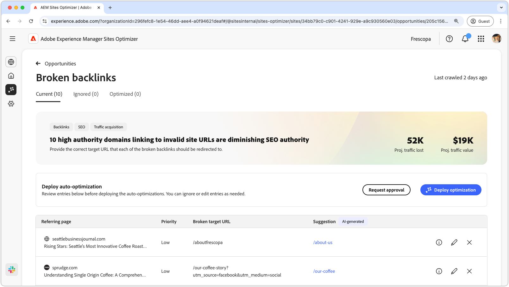
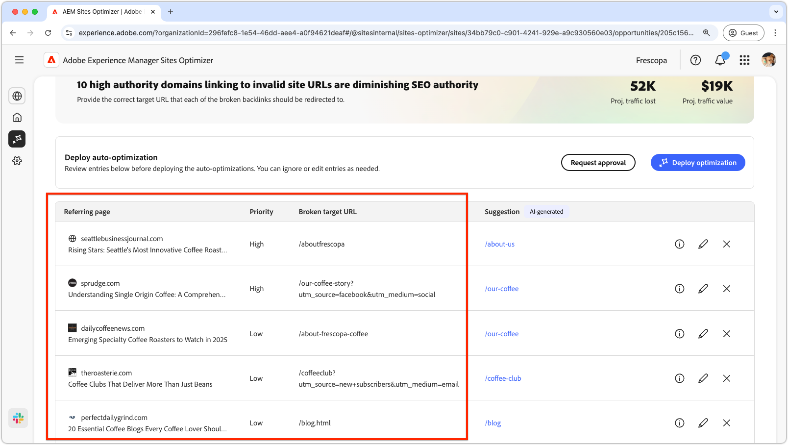
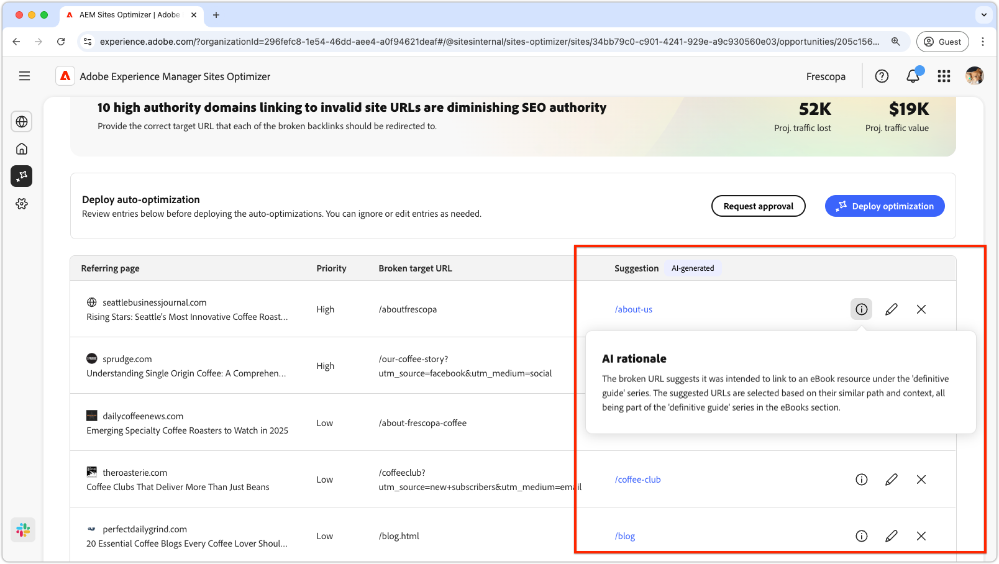
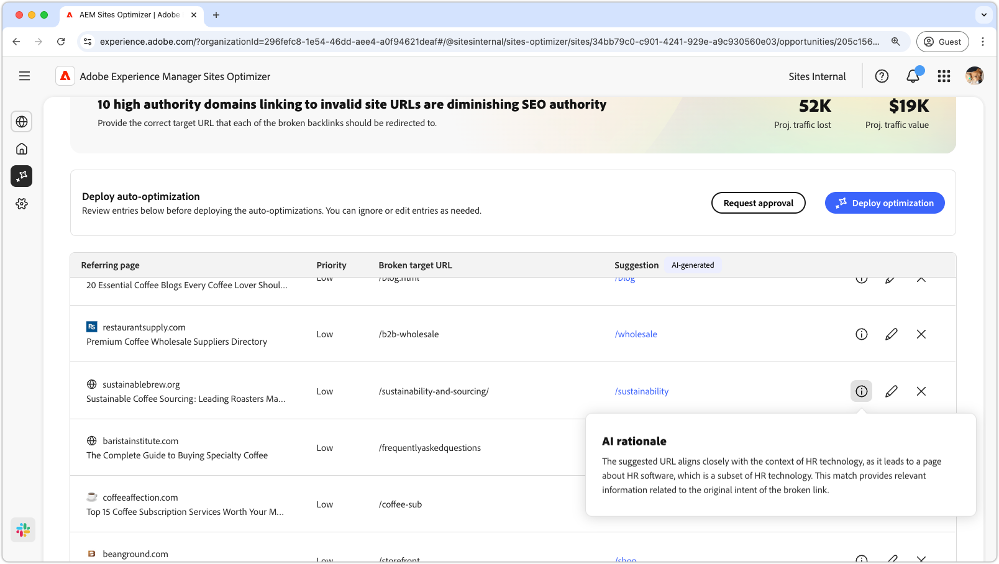
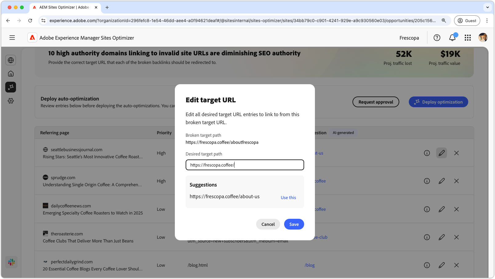
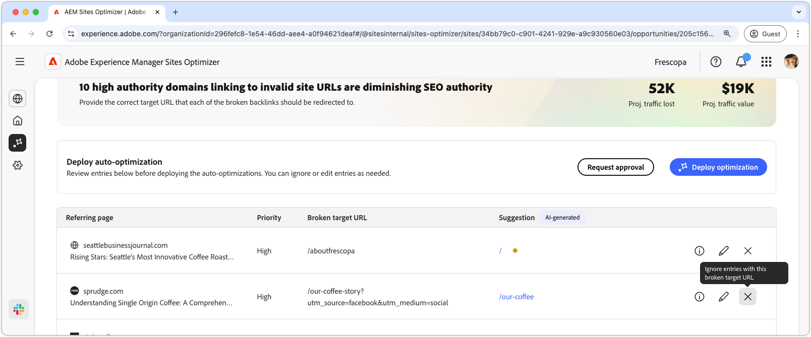

# Broken backlinks opportunity

<!--{align="center"}-->

>[!VIDEO](https://video.tv.adobe.com/v/3483250/?learn=on&enablevpops)

The broken backlinks opportunity identifies external links pointing to non-existent (404) pages on your site. These links result in lost referral traffic and reduced SEO value since search engines rely on backlinks to assess relevance and authority. These issues occur when URLs are changed, content is removed or pages are no longer available without proper redirects. AEM Sites Optimizer identifies all broken backlinks, provides specific AI recommendations and enables one-click deployment to fix them, all in a single centralized view.

## Auto-identify

<!--{align="center"}-->

AEM Sites Optimizer continuously scans external data sources to detect backlinks pointing to non-existent 404 pages on your site. Data is aggregated from multiple sources, including Google Search Console, [Operational Telemetry](https://experienceleague.adobe.com/en/docs/experience-manager-cloud-service/content/sites/operational-telemetry-for-aem-as-a-cloud-service) and third-party SEO platforms. The auto-identify opportunity identifies external domains linking to broken URLs and prioritizes them based on impact including domain authority and expected traffic and link equity losses.

This opportunity lists all identified issues, including the following details:

* **Referring domain and page** – The external page or domain that contains the broken link.
* **Priority** – High, medium or low indicating the impact the broken link has on the SEO process.
* **Broken target URL** – The non-existent URL on your site that is being linked to.

## Auto-suggest

<!--{align="center"}-->

For each identified broken backlink, AEM Sites Optimizer recommends the most appropriate destination to restore traffic and SEO value. It determines the intent of the backlink by analyzing:

* URL structure and tokens
* Anchor text
* Title and context of the referring page

This intent is matched against existing site content to identify the most relevant destination page. Each broken URL is mapped either to an exact replacement page or the closest relevant one. If no suitable destination can be determined, the issue is surfaced for manual review.

>[!BEGINTABS]

>[!TAB AI rationale]

<!--{align="center"}-->

Select the **information** icon to view the AI rationale for the suggested URL. The rationale explains why the AI believes the suggested URL is the best fit for the broken link. It can help you understand the AI's decision-making process and make an informed decision on whether to accept or reject the suggestion.

>[!TAB Edit target URL]

<!--{align="center"}-->

If you disagree with the AI-generated suggestion, you can edit the suggested URL by selecting the **edit icon**. Editing lets you manually input the URL you believe is the best fit for the broken link. Sites Optimizer also lists any other URLs on your site that it believes may be a good fit for the broken link.

>[!TAB Ignore entries]

<!--{align="center"}-->

You can choose to ignore entries with the targeted broken URLs. Selecting  removes the broken backlink from the opportunity list. Ignored broken backlinks can be re-engaged from the **Ignored** tab at the top of the opportunity page.

>[!ENDTABS]

## Auto-optimize

<!--[!BADGE Ultimate]{type=Positive tooltip="Ultimate"}-->

Once suggestions are reviewed and approved, you can click **Deploy Optimization**. AEM Sites Optimizer then applies the fixes into the authoring environment, based on how redirects are managed within your implementation. The AEM author can then publish the changes from the Content Management System (CMS).

Depending on the configuration, fixes are applied as either content or code changes within the existing deployment workflows. The optimization process includes the following steps:

* **Validation** – Ensures the changes function as expected and do not introduce regressions before deployment.
* **Deployment** – Applies changes through existing processes, such as content updates in AEM or code deployment via CI/CD pipelines.
* **Permissions check** – Verifies that the user has the appropriate permissions to deploy changes. If not, alternative outputs such as downloadable redirect lists or code patches are provided.

This process ensures that redirects are implemented accurately, validated before release, and aligned with existing configurations and governance processes.
