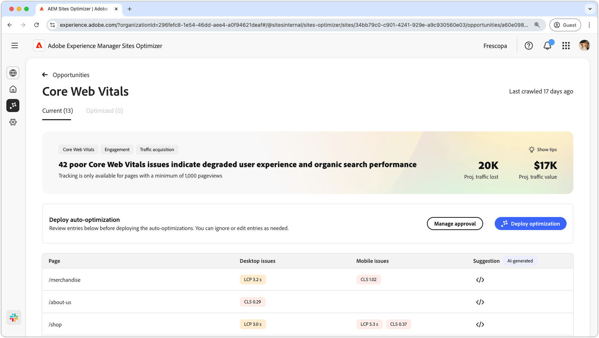
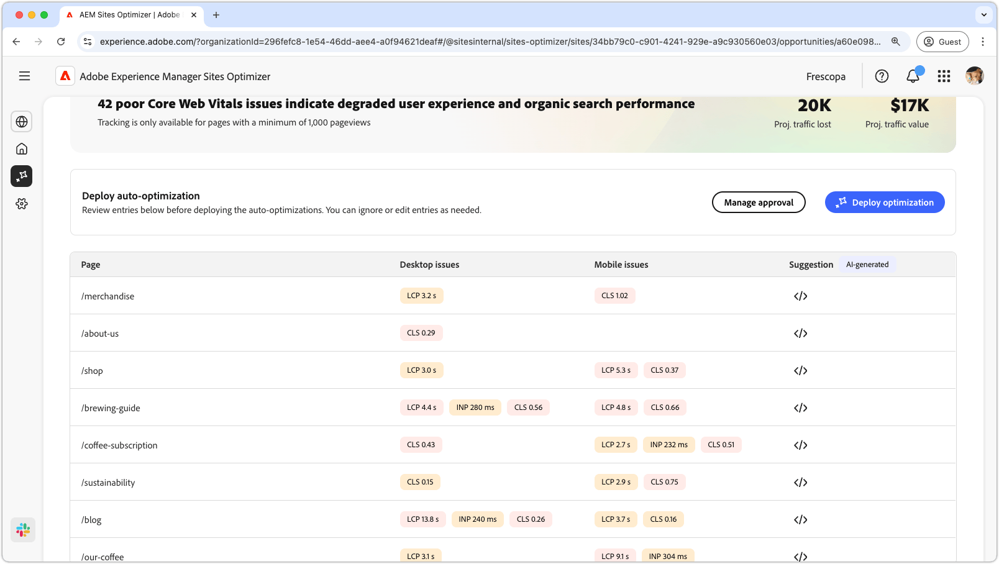
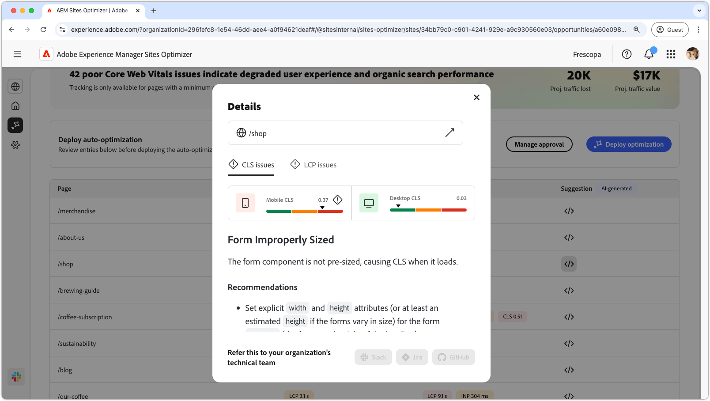

# Core web vitals opportunity

<!--{align="center"}-->

>[!VIDEO](https://video.tv.adobe.com/v/3483371/?learn=on&enablevpops)

The Core Web Vitals opportunity identifies pages on your website that are underperforming impacting user experience and organic search performance. These issues can arise from factors such as custom fonts, unoptimized JavaScript dependencies and third-party scripts. Core Web Vitals measures how quickly content loads, how stable the page layout is, and how responsive the page is to user interactions.

AEM Sites Optimizer detects pages impacted by these issues, provides specific AI recommendations at the code level and applies fixes through your existing development workflows. Please note that only pages with at least 1000 page views can be analyzed.

## Auto-identify

<!--{align="center"}-->

AEM Sites Optimizer continuously monitors site performance by using [Operational Telemetry](https://experienceleague.adobe.com/en/docs/experience-manager-cloud-service/content/sites/operational-telemetry-for-aem-as-a-cloud-service) to detect regressions in Core Web Vitals metrics such as Largest Contentful Paint (LCP), Cumulative Layout Shift (CLS) and Interaction to Next Paint (INP). It uses real user data to identify performance regressions and prioritizes issues based on their impact on user experience.

AEM Sites Optimizer displays the list of all the current issues, detailed by mobile and desktop. The **Page** column indicates the affected page entry and issues are categorized by LCP, INP and CLS.

## Auto-suggest

<!--{align="center"}-->

For each identified issue, AEM Sites Optimizer generates prescriptive code-level recommendations to improve Core Web Vitals performance. It evaluates the underlying implementation by accessing your code repository. This allows the system to analyze how components, scripts and styles are implemented and identify the root cause of the performance issues. Based on this analysis, the system provides targeted recommendations and generates code patches that specify the changes needed to improve performance. Each recommendation can be reviewed before being applied.

When you click the suggestion button, a new window appears that contains the performance metrics LCP, INP and CLS as categories. You can switch between these categories to see the list of specific issues. Each category can contain several issues, so make sure to scroll down to see the full list of issues and recommendations. Additionally, there are two performance gauges for both mobile and desktop for each metric.

## Auto-optimize

<!--[!BADGE Ultimate]{type=Positive tooltip="Ultimate"}-->

Once recommendations are reviewed and approved, you can click **Deploy Optimization**. AEM Sites Optimizer generates code patches based on the identified issues and makes them available through version control processes. The optimization process includes the following steps:

* **Issue creation** – Creates a labeled GitHub issue for each fix, including a clear description and affected URL for visibility.
* **Pull request delivery** – Automatically opens a linked pull request with the exact code fix, ready for review, testing, and merge.
* **Status tracking** – Tracks each fix through completion, flagging partial or failed attempts for follow-up.

Before making these updates available, AEM Sites Optimizer performs validation to ensure that the fixes address the underlying issue and do not introduce regressions. All updates follow standard development practices, requiring review and approval before being merged into production.

This ensures that performance optimizations are accurate, validated and integrated into existing development and governance processes.
