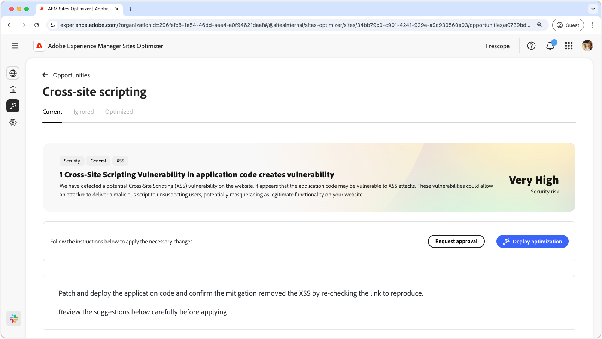
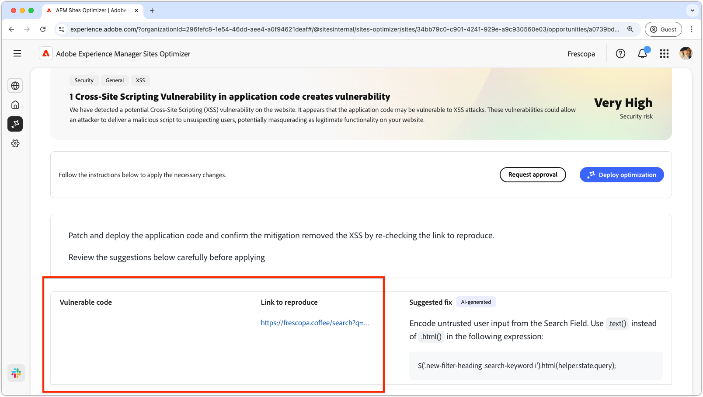
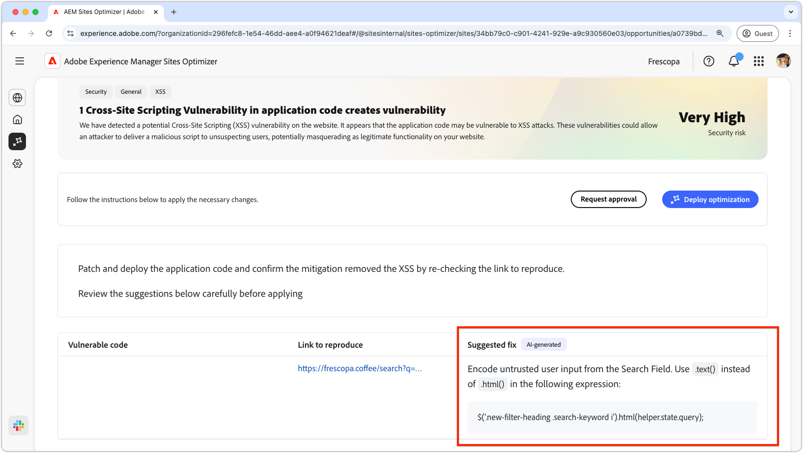

# Cross-site scripting opportunity

{align="center"}

The cross-site scripting opportunity identifies vulnerabilities in your site's code. It then fixes issues that attackers could exploit to inject malicious scripts into web pages viewed by other users. These scripts can steal sensitive information, such as session cookies, or perform actions on behalf of the user, such as changing the user's password.

## Auto-identify

{align="center"} 

* **Vulnerable code** - Any code that is vulnerable to cross-site scripting attacks.
* **Link to reproduce** - The link to the page where the vulnerability was found.

## Auto-suggest

{align="center"}

* **Suggested fix** - An AI-generated suggestion on how to fix the vulnerability.

## Auto-optimize

[!BADGE Ultimate]{type=Positive tooltip="Ultimate"}

>[!BEGINTABS]

>[!TAB Deploy optimization]

{{auto-optimize-deploy-optimization-slack}}

>[!TAB Request approval]

{{auto-optimize-request-approval}}

>[!ENDTABS]
