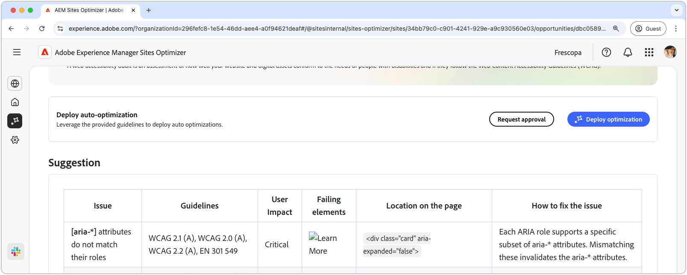

# Forms accessibility issues opportunity

 The Forms Optimizer capability is available under early access program. You can write to aem-forms-ea@adobe.com from your official email id to join the early access program and request access to the capability. 

{align="center"}

The forms accessibility issues opportunity identifies how well your forms conform to the needs of people with disabilities and if they follow the [Web Content Accessibility Guidelines (WCAG)](https://www.w3.org/TR/WCAG21/). By assessing how well your forms conform to WCAG, you help create an inclusive form experience, allowing individuals with visual, auditory, cognitive, and motor impairments to navigate, interact with, and successfully complete your forms. Not only is this essential for ethical reasons, but it also promotes compliance with legal requirements, improves form completion rates, and can increase your audience reach, enhancing both user experience and business performance.

## Auto-identify

{align="center"} 

The **Forms accessibility issues opportunity** identifies accessibility issues specifically within your forms and includes the following:

* **Issues** – The specific accessibility issue found in your forms.
* **WCAG Criteria** – The [WCAG guidelines ID](https://www.w3.org/TR/WCAG21/) the form issue is in violation of.
* **Level** – The [Levels of Conformance](https://www.w3.org/WAI/WCAG21/Understanding/conformance#levels) of the issue. 
* **Recommendation** - Specific guidance on how to fix the accessibility issue in your forms, including code examples and best practices.
* **Source HTML** - The HTML snippet of the form element on the page affected by the issue.

## Auto-suggest

{align="center"} 

Auto-suggest provides AI-generated recommendations in the **Suggetions** field, which provides prescriptive guidance on what to do to fix the form accessibility issue.

<!-- 

## Auto-optimize

[!BADGE Ultimate]{type=Positive tooltip="Ultimate"}

{align="center"}

Sites Optimizer Ultimate adds the ability to deploy auto-optimization for the form accessibility issues found.

>[!BEGINTABS]

>[!TAB Deploy optimization]

{{auto-optimize-deploy-optimization-slack}}

>[!TAB Request approval]

{{auto-optimize-request-approval}}

>[!ENDTABS]
-->

