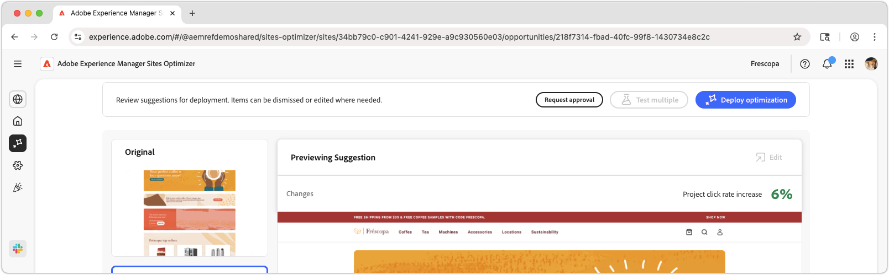

# High traffic page Has low CTR opportunity

{align="center"}

The high traffic page has low CTR opportunity identifies pages on your website that receive a significant amount of traffic but have a low click-through rate (CTR). By analyzing these pages, you can uncover potential issues that may be hindering user engagement and take steps to improve their performance. This opportunity is essential for optimizing your website's content and layout, ultimately leading to higher conversion rates and better user experiences.   

## Auto-identify

{align="center"}

The **High traffic page Has low CTR opportunity** identifies high traffic pages with low CTR on your website, and includes the following:

* **Recommendation** – Suggested action to improve the CTR of the page.
* **Insight** – Explanation of why the page has a low CTR.
* **Rationale** – The reasoning behind the recommendation.

## Auto-suggest

{align="center"}

Auto-suggest provides AI-generated suggestion for what an optimized web experience could look like. Suggestions include a **highlighted** view making it easy to see what changes are being suggested.

Suggestions can be selected to view them in full view, their projected CTR impact, and the ability to edit them before applying them to the page.

## Auto-optimize

[!BADGE Ultimate]{type=Positive tooltip="Ultimate"}

{align="center"}

Sites Optimizer Ultimate adds the ability to deploy auto-optimization for the suggested optimization.

>[!BEGINTABS]

>[!TAB Deploy optimization]

{{auto-optimize-deploy-optimization-slack}}

>[!TAB Request approval]

{{auto-optimize-request-approval}}

>[!ENDTABS]
