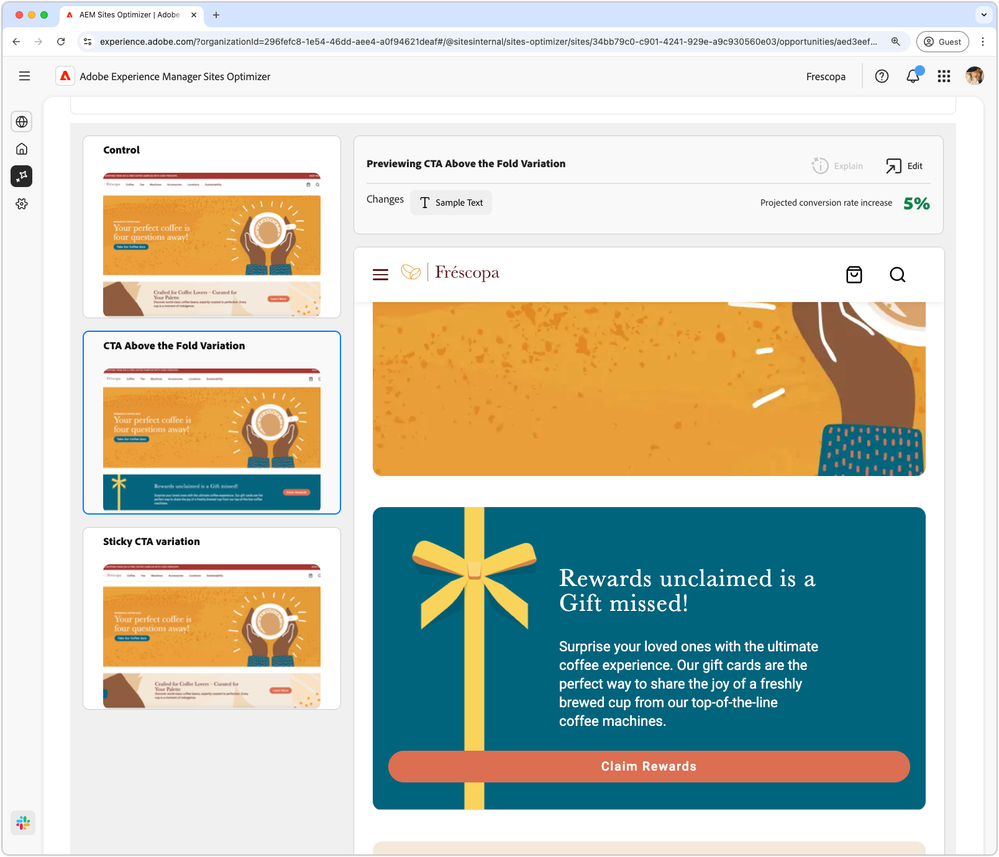

# Forms low navigation opportunity

 The Forms optimization feature is available under early adopter program. You can write to aem-forms-ea@adobe.com from your official email id to join the early adopter program and request access to the capability. 

<!-- {align="center"} -->

The low navigation opportunity identifies forms on your website that have low navigation rates. This opportunity helps you understand which forms are not being discovered or accessed by users and provides suggestions on how to improve their discoverability. By optimizing navigation to your forms, you can increase the number of form interactions and improve the overall performance of your website.

## Auto-identify

<!-- {align="center"} -->

Each webpage with a form with low navigation is listed as its own **Low navigation** opportunity. A brief summary of the opportunity, and AI-rationale, is displayed at the top of the opportunity page.

## Auto-suggest

<!-- {align="center"} -->

Auto-suggest provides AI-generated webpage variations that are designed to increase the navigation to your forms. Each variation displays the **projected conversion rate increase** based on its potential to improve form discoverability and accessibility, helping you prioritize the most effective suggestions.

>[!BEGINTABS]

>[!TAB Control variation]

<!-- {align="center"} -->

The control variation is the original form that is currently live on your website. This variation is used as a baseline to compare the performance of the suggested variations.

>[!TAB Suggested variations]

<!-- {align="center"} -->

The suggested variations are AI-generated webpage variations that are designed to increase the navigation to your forms. Each variation displays the **projected conversion rate increase** based on its potential to improve form discoverability and accessibility, helping you prioritize the most effective suggestions.

Click on each variation to preview it on the right side of the screen. In the top of the preview, the following actions and information are available:

* **Changes** - A brief summary of what changed in this variation from the **Control** variation.
* **Projected conversion rate increase** - The estimated increase in form engagement if this variation is implemented.
* **Edit** - Click to edit the variation in AEM authoring.

>[!ENDTABS]

<!-- 

## Auto-optimize

[!BADGE Ultimate]{type=Positive tooltip="Ultimate"}

{align="center"}

Sites Optimizer Ultimate adds the ability to deploy auto-optimization for the issues found by the low navigation opportunity.

>[!BEGINTABS]

>[!TAB Test multiple]

>[!TAB Publish selected]

{{auto-optimize-deploy-optimization-slack}}

>[!TAB Request approval]

{{auto-optimize-request-approval}}

>[!ENDTABS]

--> 
