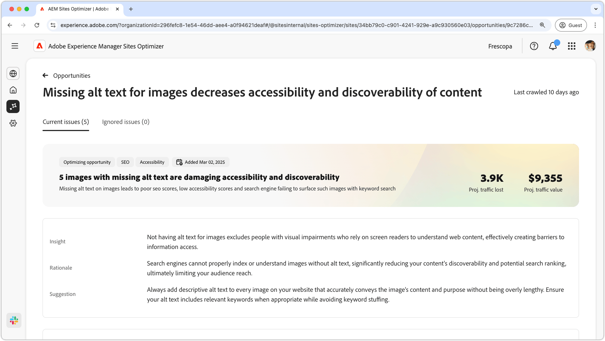
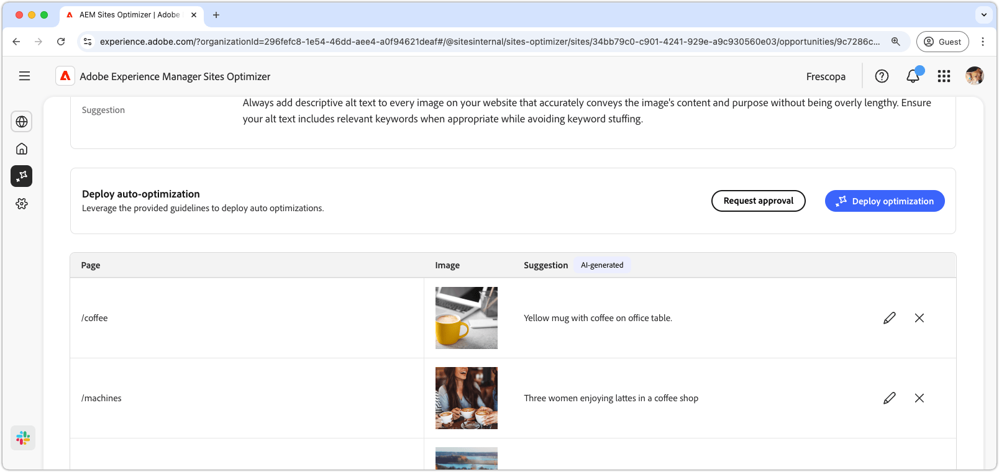
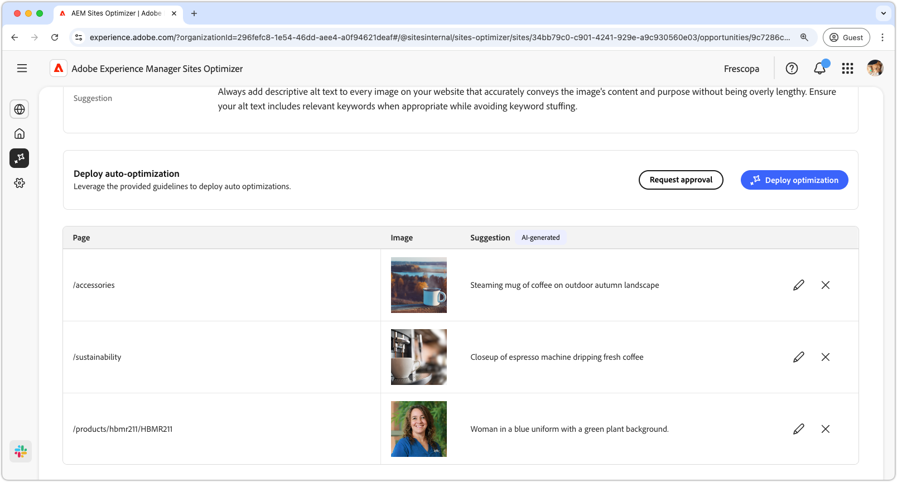
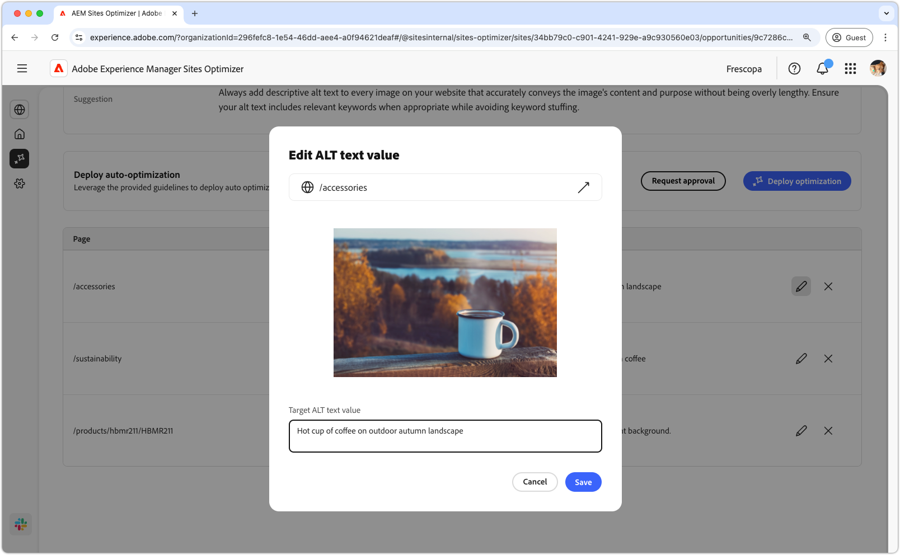
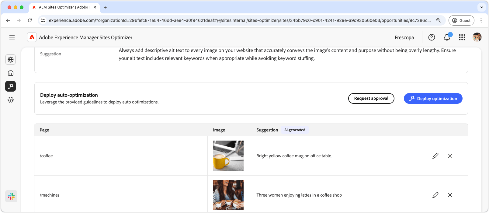

# Missing alt text opportunity

{align="center"}

The missing alt text opportunity identifies images on your website that do not have descriptive alternative text. Without alternative text, users who rely on screen readers cannot interpret visual content, creating accessibility barriers. It also limits how search engines understand and index images, reducing content discoverability and search performance. AEM Sites Optimizer identifies missing alt text issues, provides specific AI recommendations, and enables one-click deployment to fix them, all in a single centralized view.

## Auto-identify

{align="center"}

AEM Sites Optimizer scans your website by using a multi-step audit that combines site crawling, real user traffic data and AI analysis to identify images that require alt text but do not have it defined. It also evaluates images on the page to determine whether alt text is necessary, excluding decorative or non-informative images in accordance with the Web Content Accessibility Guidelines (WCAG). Images are analyzed based on their role and relevance within the page prioritizing fixes that have the greatest impact on accessibility and SEO.

This opportunity provides a list of identified issues, including:

* **Page** – The path to the page that contains the missing alt text.
* **Image** – The image that is missing the descriptive alt text.

## Auto-suggest

{align="center"}

For each identified issue, AEM Sites Optimizer suggests a descriptive alternative text for the image. It uses AI vision models to analyze the image and generate a description that reflects its content and role within the page. Recommendations are concise, relevant and aligned with accessibility best practices. Each suggestion can be reviewed and edited before being applied.

>[!BEGINTABS]

>[!TAB Edit missing alt text]

{align="center"}

If you disagree with the AI-generated suggestion, you can edit the suggested alt text by selecting the **edit icon**. This ability lets you manually adjust the text you believe is the best fit for the image. The edit window contains the following:

* **Page path** – A read-only field displaying the path to the page where the missing alt text issue occurs. Click the arrow next to the path to open the corresponding page.
* **Image** – A read-only preview of the image that requires alt text.
* **Target ALT text** – An editable field where you can manually enter a descriptive alt text for the image. Ensure that the alt text clearly conveys the image's content and purpose concisely. When relevant, include keywords naturally without overloading them.

>[!TAB Ignore entries]

You can choose to ignore entries in the opportunity list. Selecting  removes the entry from the list. Ignored entries can be re-engaged from the **Ignored** tab at the top of the opportunity page.

>[!ENDTABS]

## Auto-optimize

[!BADGE Ultimate]{type=Positive tooltip="Ultimate"}

{align="center"}

Once suggestions are reviewed and approved you can click **Deploy Optimization**. AEM Sites Optimizer then applies the fixes into the authoring environment, based on how alt text is managed within your implementation. The AEM author can then publish the changes from the Content Management System (CMS).

Depending on the configuration, updates may be applied directly to page content, asset metadata or supporting content models. The optimization process includes the following steps:

* **Validation** – Ensures updates are applied safely without impacting existing functionality.
* **Deployment** – Applies the updates through existing processes such as content updates in AEM or integration with content APIs.
* **Permissions check** – Verifies that the user has the appropriate permissions to apply changes. If not, alternative outputs such as downloadable updates can be used for handoff.

Updates are versioned where supported, providing visibility and rollback capacity. This ensures that alt text updates are applied accurately, aligned with existing implementations and consistent with governance and accessibility standards.

AEM Sites Optimizer automatically applies alt text updates based on your setup, as follows:

>[!BEGINTABS]

>[!TAB Edge Delivery Services]

Updates the source document (for example, Google Docs or SharePoint).

>[!TAB AEM as a Cloud Service]

Writes updates directly via the Content API with versioning and fallback support.

>[!TAB Digital Asset Management (optional)]

Updates asset-level alt text where applicable.

>[!ENDTABS]
