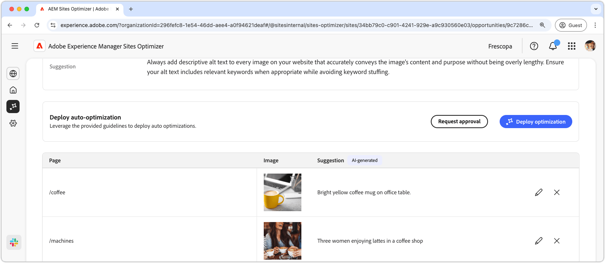

# Missing alt text opportunity

The missing alt text opportunity identifies images without descriptive alt text on your website. Search engines cannot properly index or understand images without alt text, significantly reducing your content's discoverability and potential search ranking, ultimately limiting your audience reach. Additionally, not having alt text for images excludes people with visual impairments who rely on screen readers to understand web content, effectively creating barriers to information access.

The missing alt text opportunity displays a summary at the top of the page, including a synopsis of the problem and its impact on your site and business.

* **Projected traffic lost** – The estimated traffic loss due to the missing alt text.
* **Projected traffic value** – The estimated value of the lost traffic.

There is also an additional field that displays the rationale, insight and suggestions related to the opportunity.

## Auto-identify

The missing alt text opportunity lists out all the images on your website that are missing alt text. This section contains the following categories:

* **Page** – The path to the page that contains the missing alt text.
* **Image** – The image that is missing the descriptive alt text.
* **Suggestion** - An AI-generated suggestion for the alt text.

### Edit missing alt text

If you disagree with the AI-generated suggestion, you can edit the suggested alt text by selecting the **edit icon**. This allows you to manually add the text you believe is the best fit for the image. The edit window contains the following:

* **Page Path** – The path to the page that contains the missing alt text. You can also click the arrow and it will open the targeted page.
* **Image** – The image that is missing the descriptive alt text.
* **Target ALT text value** – Edit this field and manually add the desired alt text. Ensure your alt text accurately conveys the image's content and purpose without being overly lengthy. It should also include relevant keywords when appropriate while avoiding keyword stuffing.
* **Save** - Saves and applies the text in the **Target ALT text value** field to the issue.

### Ignore suggested changes

You can choose to ignore entries in the opportunity list. Selecting the **ignore icon** removes the entry from the list. Ignored entries can be re-engaged from the **Ignored** tab at the top of the opportunity page.

## Auto-optimize [!BADGE Ultimate]{type=Positive url="../licensing.md#sites-optimizer-ultimate" tooltip="Ultimate"}

Sites Optimizer Ultimate adds the ability to deploy auto-optimization for the issues found by the missing alt text opportunity. <!--- TBD-need more in-depth and opportunity specific information here. What does the auto-optimization do?-->

Selecting **Deploy optimization** will deploy the alt text fixes to the targeted web pages. If you are not able to deploy the optimization, you can request approval from your AEM Site's administrator. Selecting **Request approval** will send an email to the AEM Site's administrator with the details of the optimization. The administrator can then approve or reject the optimization from the Sites Optimizer dashboard.
