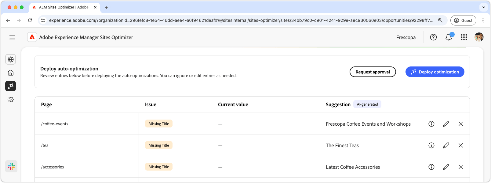

# Website vulnerabilities opportunity

The website vulnerabilities opportunity identifies security vulnerabilities in the 3rd party libraries used by your application code. These vulnerabilities could be exploited by a malicious attacker, increasing the risk and decreasing the security posture of your website.

The website vulnerabilities opportunity displays a summary at the top of the page, including the following:

* **Found issues** – The number of vulnerabilities found, categorized by the security risk they represent (low, medium, high).
* **Aggregated security risk** – The overall security risk to your website based on the vulnerabilities found by the opportunity.

## Auto-identify

The website vulnerabilities opportunity auto-identifies and lists out all the vulnerabilities found in the 3rd party libraries used by your application code. It includes the following:

* **Library** – The 3rd party library that contains the vulnerability. Several vulnerabilities can be found in one library.
* **Current version** – The current version of the library.
* **Recommended version** – The recommended version for the library.
* **Score** - The severity of the vulnerability. This risk is also aggregated in the summary at the beginning of the page.
* **Vulnerability** - The vulnerability identifier, a short description and a link to the National Vulnerability Database (NVD) for more details. The NVD link can be accessed by clicking directly on the vulnerability identifier or by clicking the link item to the right of the description.

### Ignore entries

You can choose to ignore entries from the vulnerability list. Selecting the **ignore icon** removes the entry from the list. Ignored entries can be re-engaged from the **Ignored** tab at the top of the opportunity page.<!---right now it does not seem to be implemented, but the page description mentions this functionality-->

## Auto-optimize [!BADGE Ultimate]{type=Positive url="../licensing.md#sites-optimizer-ultimate" tooltip="Ultimate"}

Sites Optimizer Ultimate adds the ability to deploy auto-optimization for the vulnerabilities found.

Selecting **Deploy optimization** will deploy the suggested updates. If you are not able to deploy the optimization, you can request approval from your AEM Site's administrator. Selecting **Request approval** will send an email to the AEM Site's administrator with the details of the optimization. The administrator can then approve or reject the optimization from the Sites Optimizer dashboard. <!--- TBD-need more in-depth and opportunity specific information here. What does the auto-optimization do?-->
