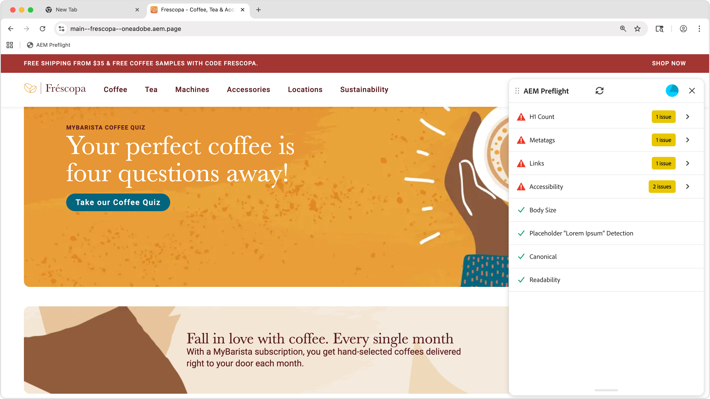

# Preflight opportunities

{align="center"}

Sites Optimizer Preflight opportunities are comprised of a set of evaluations that analyze different aspects of your website's content and structure prior to the publication of the web page. These evaluations help identify potential issues and provide actionable recommendations to improve the overall quality and performance of your site.

## Preflight setup

Follow the steps in the [Preflight setup](./setup.md) guide to configure the Preflight extension in your web site.

## Preflight opportunities

<!-- CARDS
* ./accessibility.md
* ./h1-count.md
* ./links.md
* ./meta-data.md
* ./readability.md
-->
<!-- START CARDS HTML - DO NOT MODIFY BY HAND -->

    

        

            

                <figure class="image x-is-16by9">
                    
                </figure>
            

            

                

                    

                        <a href="./accessibility.md" target="_blank" rel="referrer" title="Preflight Accessibility Opportunity">Preflight Accessibility Opportunity</a>
                    

                    
Learn about the Preflight Accessibility opportunity in Sites Optimizer.

                

                <a href="./accessibility.md" target="_blank" rel="referrer" class="spectrum-Button spectrum-Button--outline spectrum-Button--primary spectrum-Button--sizeM" style="align-self: flex-start; margin-top: 1rem;">
                    Learn more
                </a>
            

        

    

    

        

            

                <figure class="image x-is-16by9">
                    
                </figure>
            

            

                

                    

                        <a href="./h1-count.md" target="_blank" rel="referrer" title="Preflight H1 Count Opportunity">Preflight H1 Count Opportunity</a>
                    

                    
Learn about the Preflight Accessibility opportunity in Sites Optimizer.

                

                <a href="./h1-count.md" target="_blank" rel="referrer" class="spectrum-Button spectrum-Button--outline spectrum-Button--primary spectrum-Button--sizeM" style="align-self: flex-start; margin-top: 1rem;">
                    Learn more
                </a>
            

        

    

    

        

            

                <figure class="image x-is-16by9">
                    
                </figure>
            

            

                

                    

                        <a href="./links.md" target="_blank" rel="referrer" title="Preflight Links Opportunity">Preflight Links Opportunity</a>
                    

                    
Learn about the Preflight Links opportunity in Sites Optimizer.

                

                <a href="./links.md" target="_blank" rel="referrer" class="spectrum-Button spectrum-Button--outline spectrum-Button--primary spectrum-Button--sizeM" style="align-self: flex-start; margin-top: 1rem;">
                    Learn more
                </a>
            

        

    

    

        

            

                <figure class="image x-is-16by9">
                    
                </figure>
            

            

                

                    

                        <a href="./meta-data.md" target="_blank" rel="referrer" title="Preflight Metadata Opportunity">Preflight Metadata Opportunity</a>
                    

                    
Learn about the Preflight Metadata opportunity in Sites Optimizer.

                

                <a href="./meta-data.md" target="_blank" rel="referrer" class="spectrum-Button spectrum-Button--outline spectrum-Button--primary spectrum-Button--sizeM" style="align-self: flex-start; margin-top: 1rem;">
                    Learn more
                </a>
            

        

    

    

        

            

                <figure class="image x-is-16by9">
                    
                </figure>
            

            

                

                    

                        <a href="./readability.md" target="_blank" rel="referrer" title="Preflight Readability Opportunity">Preflight Readability Opportunity</a>
                    

                    
Learn about the Preflight Readability opportunity in Sites Optimizer.

                

                <a href="./readability.md" target="_blank" rel="referrer" class="spectrum-Button spectrum-Button--outline spectrum-Button--primary spectrum-Button--sizeM" style="align-self: flex-start; margin-top: 1rem;">
                    Learn more
                </a>
            

        

    

<!-- END CARDS HTML - DO NOT MODIFY BY HAND -->
