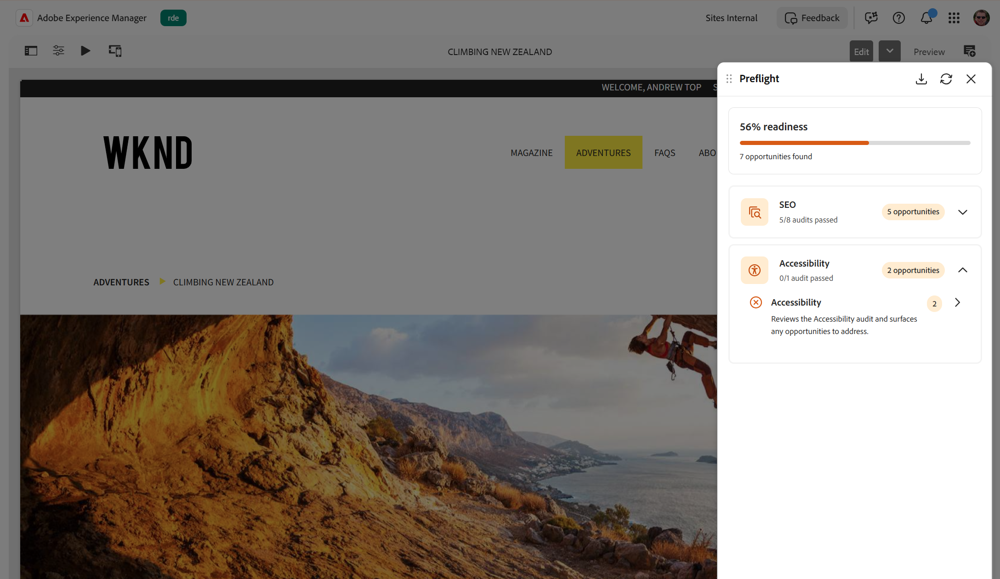

# AEM Sites Optimizer Preflight

{align="center"}

Preflight in AEM Sites Optimizer helps you validate and optimize pages before they go live by analyzing content and structure and surfacing opportunities with actionable recommendations. It is designed for authors, marketers, and developers who want to ensure pages are high quality, performant, and ready to publish while reducing rework.

You start Preflight from your authoring environment and select **Analyze page** to run its audits. An audit evaluates one aspect of your page, such as its metadata or heading structure, and Preflight groups related audits into categories, such as **SEO** and **Accessibility**. Preflight then reports a readiness score for the page, along with the opportunities it finds — the specific things you can improve, each with an actionable recommendation.

## Get started with Preflight

Getting started with Preflight is easy. Set up Preflight, open it in your authoring environment, run an audit on your page, and Preflight does the rest.

1. [Set up Preflight](./setup.md) – Learn how to set up Preflight for your AEM instance
1. [Access Preflight](./access-preflight.md) – Learn where Preflight appears in your authoring environment
1. [Run audits](./audits.md) – Learn how to start a Preflight audit
1. [Audit results and opportunities](./audit-results.md) – Learn how to interpret audit results

## Preflight audit categories

<!--
CARDS

* ./opportunities/accessibility.md
* ./opportunities/seo.md
-->
<!-- START CARDS HTML - DO NOT MODIFY BY HAND -->

    

        

            

                <figure class="image x-is-16by9">
                    
                </figure>
            

            

                

                    

                        <a href="./opportunities/accessibility.md" target="_blank" rel="referrer" title="Preflight Accessibility Audits">Preflight Accessibility Audits</a>
                    

                    
Learn about the Preflight Accessibility audits in Sites Optimizer.

                

                <a href="./opportunities/accessibility.md" target="_blank" rel="referrer" class="spectrum-Button spectrum-Button--outline spectrum-Button--primary spectrum-Button--sizeM" style="align-self: flex-start; margin-top: 1rem;">
                    Learn more
                </a>
            

        

    

    

        

            

                <figure class="image x-is-16by9">
                    
                </figure>
            

            

                

                    

                        <a href="./opportunities/seo.md" target="_blank" rel="referrer" title="Preflight SEO Audits">Preflight SEO Audits</a>
                    

                    
Learn about the Preflight SEO audits in Sites Optimizer.

                

                <a href="./opportunities/seo.md" target="_blank" rel="referrer" class="spectrum-Button spectrum-Button--outline spectrum-Button--primary spectrum-Button--sizeM" style="align-self: flex-start; margin-top: 1rem;">
                    Learn more
                </a>
            

        

    

<!-- END CARDS HTML - DO NOT MODIFY BY HAND -->
