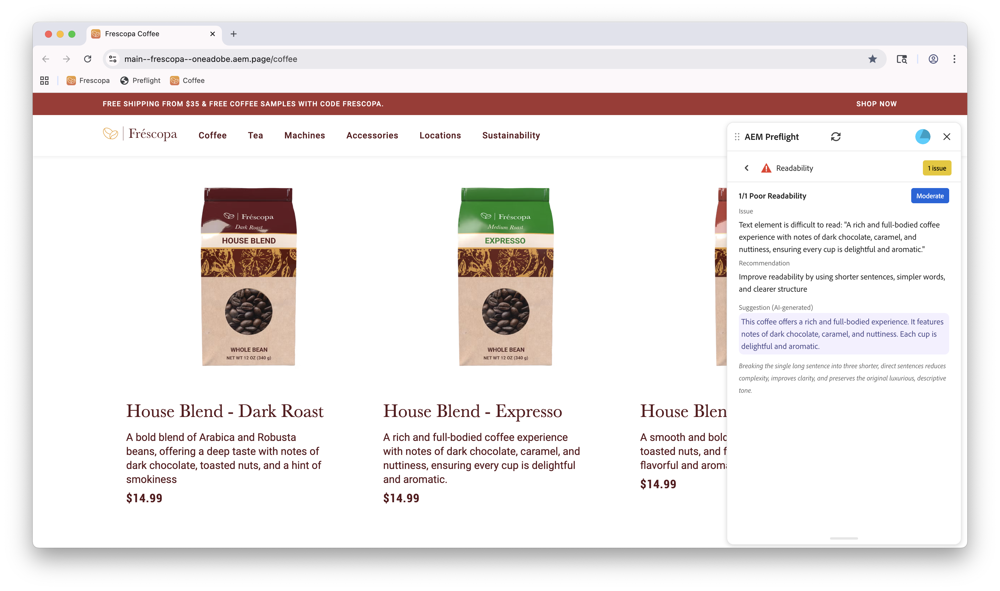

# Preflight Readability opportunity

{align="center"}

The Preflight Readability opportunity in Sites Optimizer helps you identify and address issues related to the readability of your website's content. This opportunity focuses on evaluating your site's content structure and provides actionable recommendations for improvement.

Preflight Readability opportunities are available in multiple languages, including:

* English
* French
* Spanish
* Italian
* German
* Dutch

This ensures teams can evaluate and optimize content readability across a wide range of audiences.
