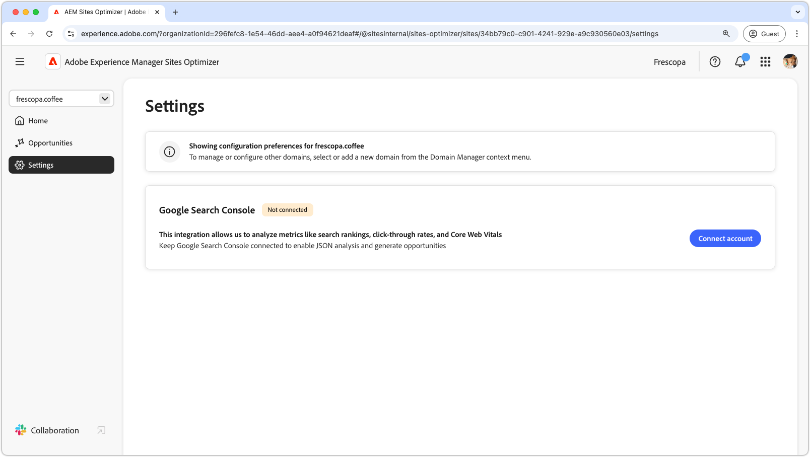
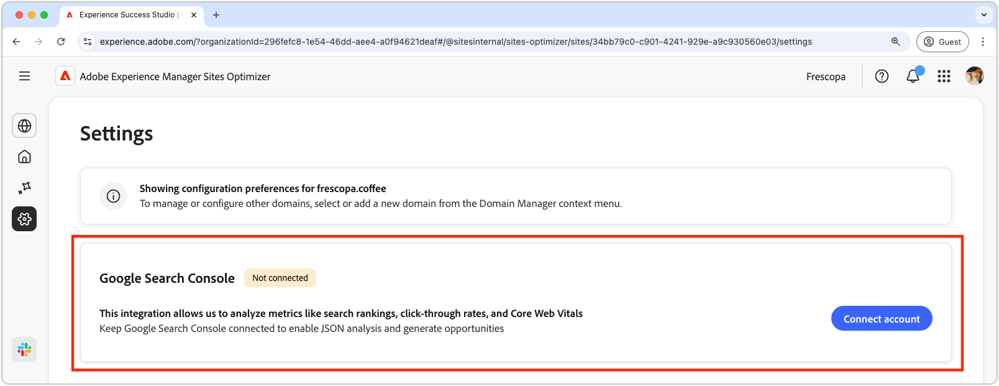
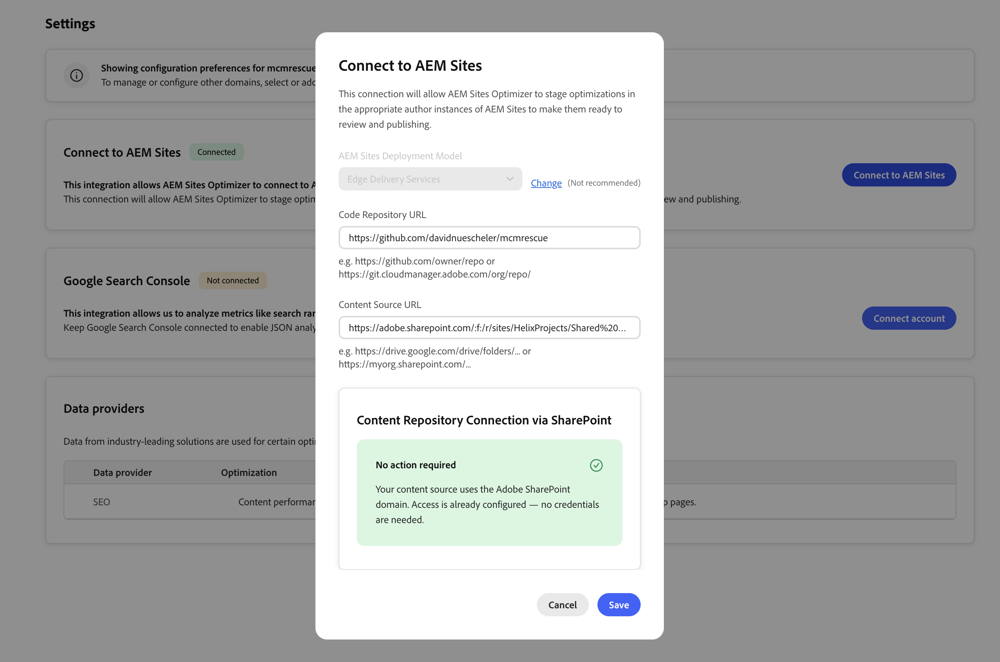
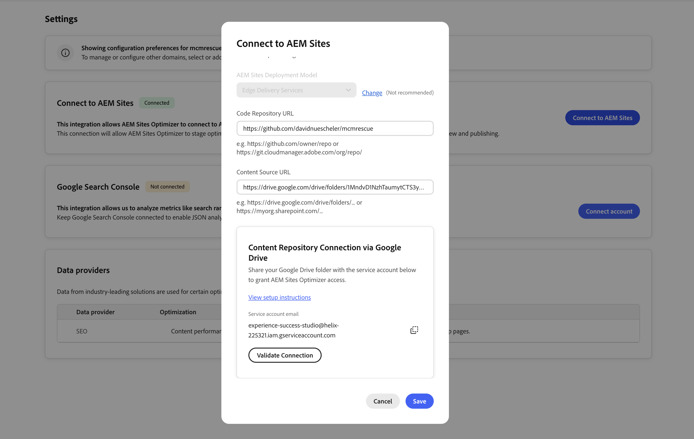

# Sites Optimizer settings

{align="center"}

Sites Optimizer settings are the central hub for configuring your Sites Optimizer experience.

## Google Search Console

{align="center"}

The Google Search Console settings connector in AEM Sites Optimizer enables the analysis of key SEO metrics like search rankings, click-through rates, and Core Web Vitals. By keeping Google Search Console connected, you can leverage JSON analysis to uncover optimization opportunities and improve site performance.

To set up this connector, you must have credentials with administrative access to Google Search Console for the domain.

## Connect to AEM Sites

This following guide explains how to connect your existing Edge Delivery Services (EDS) site to AEM Sites Optimizer. Before you begin, make sure your EDS site is already set up and working — this connection is specifically for AEM Sites Optimizer to access your content.

The connection requires two steps:

1. Provide your code repository URL and content source URL.
2. Grant AEM Sites Optimizer access to your content source.

### Step 1 — Link your code repository and content source

In AEM Sites Optimizer, go to **Settings → Connect to AEM Sites** and enter the following:

- **Code Repository URL** — the GitHub URL of your EDS site, for example:
  `https://github.com/owner/repo`

- **Content Source URL** — the URL of the SharePoint folder or Google Drive folder that backs your EDS site, for example:
  `https://drive.google.com/drive/folders/...` or `https://myorg.sharepoint.com/...`

Once you enter the Content Source URL, AEM Sites Optimizer will detect your content source type and show the relevant access instructions below.

### Step 2 — Grant access to your content source

Follow the section that matches your content source.

#### SharePoint — Adobe domain

{align="center"}

If your Content Source URL uses the Adobe SharePoint domain, no further action is required. Access is already configured. Click **Save** to complete the connection.

#### SharePoint — Custom domain

If your Content Source URL uses your organization's own SharePoint domain, you need to register an Azure application and provide its credentials to AEM Sites Optimizer.

##### What you will need

- Permission to register applications in the Azure Portal, or a contact who can register applications on your behalf.
- Tenant administrator rights to grant API consent, or an administrator who can approve the API consent for you.

##### Step 2a — Register an application in Azure

1. Go to **Azure Portal → Microsoft Entra ID → App Registrations → New Registration**.
2. Give it a name, for example: `AEM Sites Optimizer`.
3. Leave all other defaults and click **Register**.
4. On the **Overview** page, note down:
   - **Application (client) ID**
   - **Directory (tenant) ID**

##### Step 2b — Add API permissions

1. Go to **API Permissions → Add a permission → Microsoft Graph → Application permissions**.
2. Add both the following:
   - `Sites.Selected` — scoped access to specific SharePoint site collections.
   - `Files.SelectedOperations.Selected` — file access without a signed-in user.
3. Click **Grant admin consent** for both.

{align="center"}

>[!NOTE]
>
>Granting admin consent requires tenant administrator rights. If you do not have this, ask your IT or Azure administrator to complete this step before proceeding.

##### Step 2c — Create a client secret

{align="center"}

1. Go to **Certificates & Secrets → New Client Secret**.
2. Set a description and an expiry, then click **Add**.
3. Copy the secret value immediately — it is only shown once.

##### Step 2d — Grant the app access to your SharePoint site

You can grant the app access by using Microsoft Graph Explorer, PowerShell, or direct Graph API calls.

Navigate to [Microsoft Graph Explorer](https://developer.microsoft.com/graph/graph-explorer), sign in with your Microsoft account, and run the following requests:

1. Find your site ID:

```
GET https://graph.microsoft.com/v1.0/sites/{tenant}.sharepoint.com:/sites/{site-name}
```

1. Copy the `id` from the response, then grant site-level access:

```
POST https://graph.microsoft.com/v1.0/sites/{siteId}/permissions
```

Body:

```json
{
  "roles": ["write"],
  "grantedToIdentities": [{
    "application": {
      "id": "{your-client-id}",
      "displayName": "{Your app name}"
    }
  }]
}
```

##### Step 2e — Enter credentials in AEM Sites Optimizer

{align="center"}

Back in the **Connect to AEM Sites** dialog, enter the following under **Content Repository Connection via SharePoint**:

- **Tenant ID (Azure AD)** — from App Registration → Overview.
- **Client ID (App Registration)** — from App Registration → Overview.
- **Client Secret** — created in Step 2c.

Click **Validate Connection** to confirm access, then click **Save**.

#### Google Drive

{align="center"}

1. In Google Drive, right-click the folder that backs your EDS site and select **Share**.
2. In the **Add people and groups** field, enter the service account email shown in the **Connect to AEM Sites** dialog:
   `experience-success-studio@helix-225321.iam.gserviceaccount.com`
3. Set the permission level to **Editor**.
4. Uncheck **Notify people** and click **Share**.

Once sharing is complete, click **Validate Connection** in the dialog, then click **Save**.
