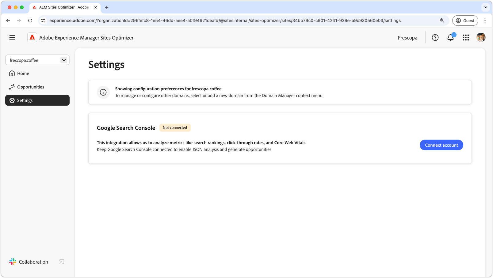
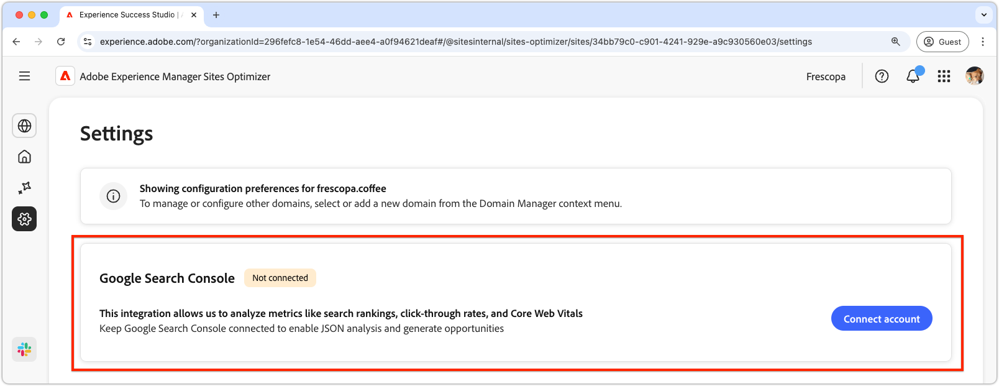
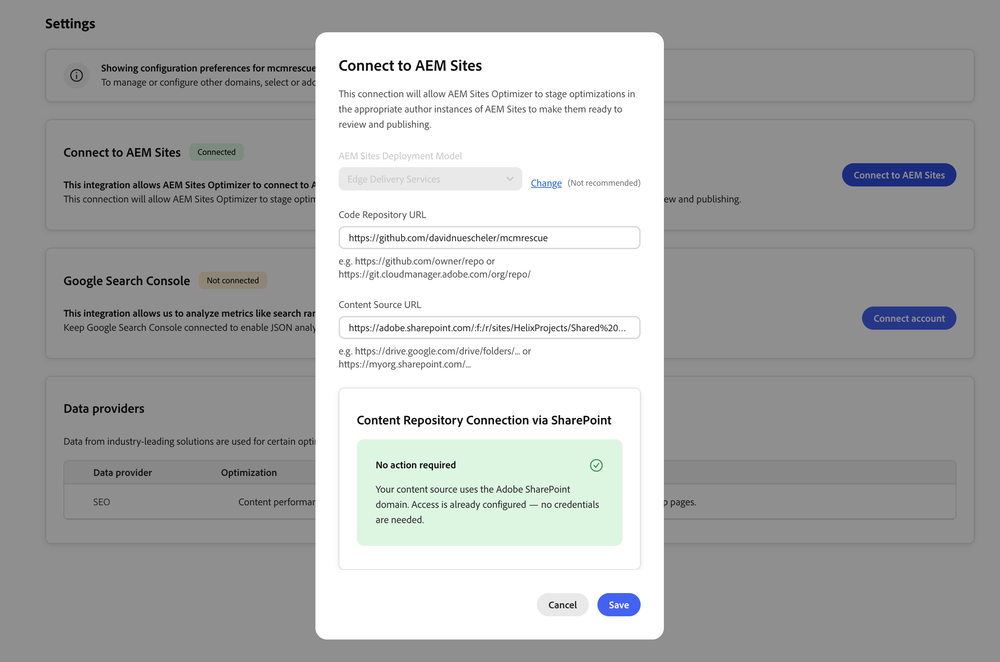
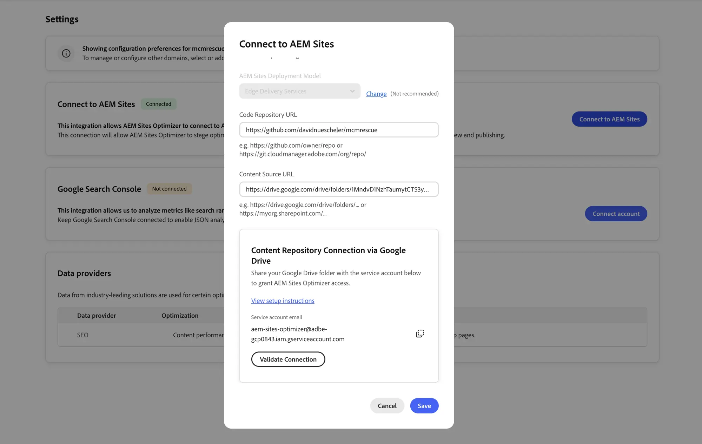

# Sites Optimizer settings

{align="center"}

Sites Optimizer settings are the central hub for configuring your Sites Optimizer experience.

## Google Search Console

{align="center"}

The Google Search Console settings connector in AEM Sites Optimizer enables the analysis of key SEO metrics like search rankings, click-through rates, and Core Web Vitals. By keeping Google Search Console connected, you can leverage JSON analysis to uncover optimization opportunities and improve site performance.

To set up this connector, you must have credentials with administrative access to Google Search Console for the domain.

## Connect to AEM Sites

This following guide explains how to connect your existing Edge Delivery Services (EDS) site to AEM Sites Optimizer. Before you begin, make sure your EDS site is already set up and working — this connection is specifically for AEM Sites Optimizer to access your content.

The connection requires two steps:

1. Provide your code repository URL and content source URL.
2. Grant AEM Sites Optimizer access to your content source.

### Step 1 — Link your code repository and content source

In AEM Sites Optimizer, go to **Settings → Connect to AEM Sites** and enter the following:

- **Code Repository URL** — the GitHub URL of your EDS site, for example:
  `https://github.com/owner/repo`

- **Content Source URL** — the URL of the SharePoint folder or Google Drive folder that backs your EDS site, for example:
  `https://drive.google.com/drive/folders/...` or `https://myorg.sharepoint.com/...`

Once you enter the Content Source URL, AEM Sites Optimizer will detect your content source type and show the relevant access instructions below.

### Step 2 — Grant access to your content source

Follow the section that matches your content source.

#### SharePoint — Adobe domain

{align="center"}

If your Content Source URL uses the Adobe SharePoint domain, no further action is required. Access is already configured. Click **Save** to complete the connection.

#### SharePoint — Custom domain

If your Content Source URL uses your organization's own SharePoint domain, you need to register an Azure application and provide its credentials to AEM Sites Optimizer.

##### What you will need

- Permission to register applications in the Azure Portal, or a contact who can register applications on your behalf.
- Tenant administrator rights to grant API consent, or an administrator who can approve the API consent for you.

##### Step 2a — Register an application in Azure

1. Go to **Azure Portal → Microsoft Entra ID → App Registrations → New Registration**.
2. Give it a name, for example: `AEM Sites Optimizer`.
3. Leave all other defaults and click **Register**.
4. On the **Overview** page, note down:
   - **Application (client) ID**
   - **Directory (tenant) ID**

##### Step 2b — Add API permissions

1. Go to **API Permissions → Add a permission → Microsoft Graph → Application permissions**.
2. Add both the following:
   - `Sites.Selected` — scoped access to specific SharePoint site collections.
   - `Files.SelectedOperations.Selected` — file access without a signed-in user.
3. Click **Grant admin consent** for both.

{align="center"}

>[!NOTE]
>
>Granting admin consent requires tenant administrator rights. If you do not have this, ask your IT or Azure administrator to complete this step before proceeding.

##### Step 2c — Create a client secret

{align="center"}

1. Go to **Certificates & Secrets → New Client Secret**.
2. Set a description and an expiry, then click **Add**.
3. Copy the secret value immediately — it is only shown once.

##### Step 2d — Grant the app access to your SharePoint site

You can grant the app access by using Microsoft Graph Explorer, PowerShell, or direct Graph API calls.

Navigate to [Microsoft Graph Explorer](https://developer.microsoft.com/graph/graph-explorer), sign in with your Microsoft account, and run the following requests:

1. Find your site ID:

```
GET https://graph.microsoft.com/v1.0/sites/{tenant}.sharepoint.com:/sites/{site-name}
```

1. Copy the `id` from the response, then grant site-level access:

```
POST https://graph.microsoft.com/v1.0/sites/{siteId}/permissions
```

Body:

```json
{
  "roles": ["write"],
  "grantedToIdentities": [{
    "application": {
      "id": "{your-client-id}",
      "displayName": "{Your app name}"
    }
  }]
}
```

##### Step 2e — Enter credentials in AEM Sites Optimizer

{align="center"}

Back in the **Connect to AEM Sites** dialog, enter the following under **Content Repository Connection via SharePoint**:

- **Tenant ID (Azure AD)** — from App Registration → Overview.
- **Client ID (App Registration)** — from App Registration → Overview.
- **Client Secret** — created in Step 2c.

Click **Validate Connection** to confirm access, then click **Save**.

#### Google Drive

{align="center"}

1. In Google Drive, right-click the folder that backs your EDS site and select **Share**.
2. In the **Add people and groups** field, enter the service account email shown in the **Connect to AEM Sites** dialog:
   `aem-sites-optimizer@adbe-gcp0843.iam.gserviceaccount.com`
3. Set the permission level to **Editor**.
4. Uncheck **Notify people** and click **Share**.

Once sharing is complete, click **Validate Connection** in the dialog, then click **Save**.

## Manage user permissions

Control who can access a site in Sites Optimizer and what they can do with it. Access is built from a small set of independent *capabilities* — View, Edit, Deploy, Configure, and Manage users — that you grant to each person.

Access is **additive**: a person's permissions are the sum of everything they've been granted. There's no "deny", so grants never conflict or cancel each other out. To give someone less access, remove a grant rather than trying to override it.

### How access is granted

There are two ways a person can get access, and they work together:

- **Organization-wide access** — assigned by your Adobe org administrator in the [Adobe Admin Console](https://adminconsole.adobe.com/). It applies across every site in your organization. Use it for people who need the same access everywhere.
- **Site-level access** — assigned inside Sites Optimizer, on the **Settings → Permissions** page. It applies to a single site and can be as broad or as narrow as you need. No Admin Console access is required.

>[!NOTE]
>
>The two layers add up. Someone with organization-wide view access who is also granted Edit on one site can view every site and edit that one. To keep a person limited to a single site, make sure they don't also hold an organization-wide role.

#### Organization-wide roles (Admin Console)

Organization-wide access comes from one of two **AEM Sites Optimizer** product roles, assigned in the [Adobe Admin Console](https://adminconsole.adobe.com/):

- **ASO Manager** — full access to every site, including **Manage users**. A Manager can open the **Permissions** page for any site and assign access to others.
- **ASO User** — view-only access to every site. No changes and no user management.

To assign a role, you must be a **System administrator** for the organization, or a **product administrator** for AEM Sites Optimizer.

1. Sign in to the [Adobe Admin Console](https://adminconsole.adobe.com/).
1. Go to **Products** and select **AEM Sites Optimizer**.
1. Open the **Users** tab and add the user by email (or select an existing user).
1. Click the **+** (add) icon to add a product profile, then choose the product profile.

   {align="center"}

1. Click **Next**.
1. Choose the role — **ASO Manager** for full access, or **ASO User** for view-only access — then click **Apply**.

   {align="center"}

   {align="center"}

For more on adding users, see [Onboard users](setup/onboard-users.md).

>[!IMPORTANT]
>
>Only an organization administrator can grant organization-wide **Manage users**. A member who has **Manage users** on a site can assign access on that site, but can't create an organization-wide **ASO Manager**.

### Capability levels

Each capability controls one kind of action. They're independent — for example, you can grant Deploy without Edit.

| Capability | What it allows | What it does not allow |
|---|---|---|
| View | See the site's data — opportunities, suggestions, fixes, reports, and configuration — without changing anything. | Any change. |
| Edit | Create and change opportunities and suggestions (what should change). | Publishing changes, changing settings, or managing users. |
| Deploy | Publish fixes live to the site, and roll them back. | Managing users. |
| Configure | Change the site's settings and connections. | Publishing fixes, or managing users. |
| Manage users | Grant or revoke other members' access to the site. | Managing a site the person doesn't already have access to. |

>[!NOTE]
>
>**View is always included.** Every grant includes View automatically — you can't manage, configure, edit, or deploy something you can't see. Because of this, View can't be removed on its own. To remove someone's access completely, remove the member (see [Edit or remove a member](#edit-or-remove-a-member) below) instead of unchecking every capability.

### Scope access to opportunity types

On a single site, you can grant View, Edit, and Deploy for **specific opportunity types** (for example, Core Web Vitals or Broken internal links) instead of the whole site. This lets one person edit Core Web Vitals while only viewing everything else.

- **View**, **Edit**, and **Deploy** can be scoped to one or more opportunity types, or to **All** opportunity types.
- **Configure** and **Manage users** always apply to the entire site — they can't be limited to an opportunity type.

Each scoped grant appears as its own row for the member, with an **Applies to** column showing the opportunity type, **All**, or **Site-wide**.

>[!CAUTION]
>
>Scoping only limits what *that* grant gives — it never removes access another grant provides. If a person also has organization-wide access or an **All**-types grant, that broader access still applies. So to truly limit someone to specific opportunity types, make sure they don't also hold a broader role or an **All**-types grant.

### Add a member

1. Go to **Settings → Permissions** and select the site.
1. Click **Add members**.
1. Search by name or email, and select one or more people.
1. Choose the **opportunity type(s)** the access applies to (or **All**), then select the capabilities to grant.
1. Click **Add**.

<!-- MEDIA PENDING: Site Manager / Site User walkthrough videos are being re-recorded with demo data to remove PII, then re-uploaded to video.tv.adobe.com and embedded here with >[!VIDEO]. The earlier uploads v/3503767 and v/3503768 (KT-22672 / KT-22673) contain PII and must not be used. -->

### Edit or remove a member

In the **Members** table:

- Click **Edit capabilities** on a member's row to change what they can do. When you edit an existing grant, its opportunity type stays fixed — you change only the capabilities, and at least one capability must stay selected.
- Click **Remove** to revoke that member's access to the site entirely.

>[!NOTE]
>
>Changing capabilities and removing a member are different actions. To take away all access, use **Remove** — you can't do it by unchecking capabilities, because a grant must keep at least one capability (and View always stays).

### Who can manage permissions

The **Permissions** page for a site is available to:

- Members with the **Manage users** capability on that site, and
- Organization administrators (an ASO Manager).

Members without **Manage users** see a message that they don't have permission to manage access for that site.

### Turn on user and access management

User and access management is controlled by a setting for your organization. You can assign access before it's turned on, but it's only **enforced** once the setting is on.

If it isn't enabled yet, the **Permissions** page shows a banner asking you to contact your account team. Reach out to your Sites Optimizer account team to turn it on.

>[!NOTE]
>
>Until user and access management is turned on, the permissions you assign are saved but not enforced.

### Frequently asked questions

**Do site-level members need an Admin Console role?**

No. Site-level access is granted entirely inside Sites Optimizer, on the **Permissions** page. Only organization-wide roles are assigned in the Admin Console.

**What happens if someone has both organization-wide and site-level access?**

Both apply. Their effective access is the combination of the two. Grants never conflict, because no grant can deny access.

**Why can't a member with Manage users create an organization-wide Manager?**

Creating an organization-wide role is an Admin Console action. A member with **Manage users** can assign access on their own site, but only an organization administrator can grant organization-wide roles.

**How do I revoke a person's access to a site?**

Remove their grant on the **Permissions** page. This is different from editing capabilities, which must always leave at least one capability.

**Can I limit a person to specific opportunity types?**

Yes — grant View, Edit, or Deploy scoped to specific opportunity types instead of **All**. Because access is additive, this only takes effect if the person doesn't also have organization-wide access or an **All**-types grant.
