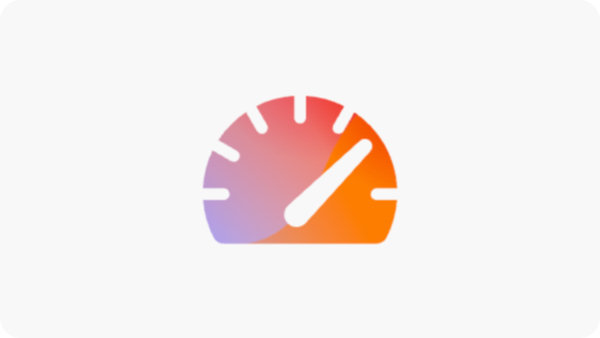
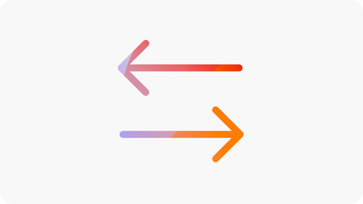

# Sites Optimizer trial

Get started with Sites Optimizer using this trial for existing AEM Sites customers (Edge Delivery Services, Cloud Services, and Managed Services). Your domain data is already pre-onboarded, so you can begin optimizing right away. The video below walks through the trial experience and shows how to get started.

>[!VIDEO](https://video.tv.adobe.com/v/3483253/?learn=on&enablevpops)

>[!TIP]
>
> Contact [siteoptimizer-now@adobe.com](mailto:siteoptimizer-now@adobe.com) with any questions or requests.

## Start your trial now!

Follow these steps to get started with your trial:

1. Log in using your AEM Sites IMS org ID to [www.sitesoptimizer.now](https://www.sitesoptimizer.now).
2. View key metrics such as page views, load time, and engagement rate, along with your top optimization opportunities prioritized by impact.
3. Explore the three available opportunity types: [broken backlinks](./opportunities/broken-backlinks.md), [Core Web Vitals](./opportunities/core-web-vitals.md), and [missing alt text](./opportunities/missing-alt-text.md).
4. For each opportunity, review up to three identified issues. Use AI-generated suggestions and deploy optimizations directly into your AEM environment when ready.
5. Unlock more opportunities by upgrading to the full license at any time.

## What is available in the trial

The following is included in the trial:

* Three opportunity types: [broken backlinks](./opportunities/broken-backlinks.md), [Core Web Vitals](./opportunities/core-web-vitals.md), and [missing alt text](./opportunities/missing-alt-text.md)
* Up to three issues per opportunity each month
* Full workflow per issue: auto-identify, auto-suggest, and auto-optimize
  * **Auto-identify** — Detects issues across your site using multiple data sources
  * **Auto-suggest** — Provides prescriptive, AI-generated recommendations for each issue
  * **Auto-optimize** — After approval, deploy fixes directly into your authoring environment. Updates follow your existing workflows, allowing your team to review and publish through AEM.

## Frequently asked questions

Read the following for answers to frequently asked questions about the AEM Sites Optimizer trial.

### What is AEM Sites Optimizer?

[AEM Sites Optimizer](/help/home.md) is an AI-first application that identifies issues across your website, provides prescriptive recommendations, and helps you fix them to increase traffic acquisition, engagement, and conversion.

### Who can participate in this trial?

Existing AEM Sites customers (Edge Delivery Services, Cloud Services, and Managed Services).

### How do I access the trial?

Go to [www.sitesoptimizer.now](https://www.sitesoptimizer.now) and log in using your AEM Sites IMS org ID.

### Does this cost anything?

No. This trial is available at no cost for existing AEM Sites customers.

### Is there an expiration date?

No. The trial is not time-based. It is limited by usage through the number of opportunity types and issues available.

### What happens after all issues are fixed?

Sites Optimizer continuously identifies issues impacting your performance. On the free trial, issues are only added monthly. Upgrade for continuous auditing and optimization.

### How do I access more opportunities?

Use the upgrade or contact sales CTAs available through the product experience, or email [siteoptimizer-now@adobe.com](mailto:siteoptimizer-now@adobe.com).

## Learn more about the opportunity types in the trial

<!--
CARDS
* ./opportunities/core-web-vitals.md
  {title=Core web vitals}
  {image=../assets/common/card-performance.png}
* ./opportunities/missing-alt-text.md
  {title=Missing alt text}
  {image=../assets/common/card-arrows.png}
* ./opportunities/broken-backlinks.md
  {title=Broken backlinks}
  {image=../assets/common/card-arrows.png}
-->

<!-- START CARDS HTML - DO NOT MODIFY BY HAND -->

    

        

            

                <figure class="image x-is-16by9">
                    
                </figure>
            

            

                

                    

                        <a href="./opportunities/core-web-vitals.md" target="_blank" rel="referrer" title="Core web vitals">Core web vitals</a>
                    

                    
Learn about the core web vitals opportunity and how to use it to improve traffic acquisition.

                

                <a href="./opportunities/core-web-vitals.md" target="_blank" rel="referrer" class="spectrum-Button spectrum-Button--outline spectrum-Button--primary spectrum-Button--sizeM" style="align-self: flex-start; margin-top: 1rem;">
                    Learn more
                </a>
            

        

    

    

        

            

                <figure class="image x-is-16by9">
                    
                </figure>
            

            

                

                    

                        <a href="./opportunities/missing-alt-text.md" target="_blank" rel="referrer" title="Missing alt text">Missing alt text</a>
                    

                    
Learn about the missing alt text opportunity and how to use it to improve engagement on your website.

                

                <a href="./opportunities/missing-alt-text.md" target="_blank" rel="referrer" class="spectrum-Button spectrum-Button--outline spectrum-Button--primary spectrum-Button--sizeM" style="align-self: flex-start; margin-top: 1rem;">
                    Learn more
                </a>
            

        

    

    

        

            

                <figure class="image x-is-16by9">
                    
                </figure>
            

            

                

                    

                        <a href="./opportunities/broken-backlinks.md" target="_blank" rel="referrer" title="Broken backlinks">Broken backlinks</a>
                    

                    
Learn about the broken backlinks opportunity and how to use it to improve traffic acquisition.

                

                <a href="./opportunities/broken-backlinks.md" target="_blank" rel="referrer" class="spectrum-Button spectrum-Button--outline spectrum-Button--primary spectrum-Button--sizeM" style="align-self: flex-start; margin-top: 1rem;">
                    Learn more
                </a>
            

        

    

<!-- END CARDS HTML - DO NOT MODIFY BY HAND -->
