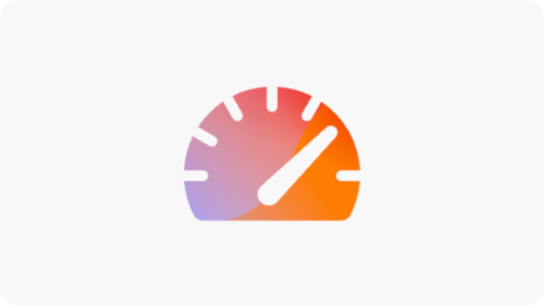
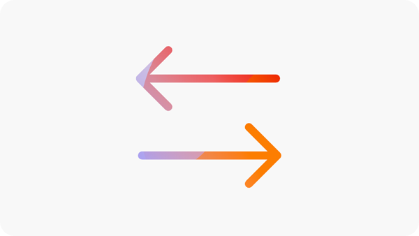

# Sites Optimizer trial

Get started with Sites Optimizer using this trial for existing **AEM Sites customers (Edge Delivery Services, Cloud Services and Managed Services)**. Your domain data is already pre-onboarded, so you can begin optimizing right away. The video below walks you through the trial experience and shows you how to get started.

>[!IMPORTANT]
>
>Before you start, make sure your site meets these requirements:
>
>* It is built on AEM Sites (Edge Delivery Services, Cloud Service, or Managed Services).
>* It is a production site, not a development, QA, staging, author, or preview environment.
>* It is publicly accessible and not behind a login.
>* It uses AEM Sites frontend delivery. Headless delivery is not currently supported.

>[!VIDEO](https://video.tv.adobe.com/v/3483253/?learn=on&enablevpops)

>[!TIP]
>
> Contact [siteoptimizer-now@adobe.com](mailto:siteoptimizer-now@adobe.com) with any questions or requests.

## Start your trial now!

Follow these steps to get started with your trial:

1. Log in using your AEM Sites IMS org ID to [www.sitesoptimizer.live](http://www.sitesoptimizer.live/).
2. View key metrics such as page views, load time, and engagement rate, along with your top optimization opportunities prioritized by impact.
3. Explore the three available opportunity types: [broken backlinks](./opportunities/broken-backlinks.md), [Core Web Vitals](./opportunities/core-web-vitals.md), and [missing alt text](./opportunities/missing-alt-text.md).
4. For each opportunity, review up to three identified issues. Use AI-generated suggestions and deploy optimizations directly into your AEM environment when ready.
5. Unlock more opportunities by upgrading to the full license at any time.

## What is available in the trial

The following is included in the trial:

* Three opportunity types: [broken backlinks](./opportunities/broken-backlinks.md), [Core Web Vitals](./opportunities/core-web-vitals.md) and [missing alt text](./opportunities/missing-alt-text.md).
* Up to three issues per opportunity each month.
* Full workflow per issue: auto-identify, auto-suggest and auto-optimize.
  * **Auto-identify** — Detects issues across your site using multiple data sources.
  * **Auto-suggest** — Provides prescriptive, AI-generated recommendations for each issue.
  * **Auto-optimize** — After approval, deploy fixes directly into your authoring environment. Updates follow your existing workflows, allowing your team to review and publish through AEM.

## Enable auto-fix for Edge Delivery trial sites

Learn how trial customers enable the **Deploy to author** action for auto-fix suggestions on Edge Delivery Services (EDS) sites authored in Google Drive or SharePoint.

>[!NOTE]
>
>This requirement applies only to trial organizations whose sites are authored in Google Drive or SharePoint. Paid customers, and sites authored in Crosswalk or Dark Alley, are not affected.

Trial customers must be part of the **ASO-EDS-Autofix-Users** IMS group. If the group doesn't exist, your organization's Admin can create it and add you.

1. Sign in to the [Adobe Admin Console](https://adminconsole.adobe.com/).
1. Select **Users** > **User groups**.
1. Select **Add User Group**.
1. For **User group name**, enter exactly:

   ```
   ASO-EDS-Autofix-Users
   ```

   >[!IMPORTANT]
   >
   > The group name must match exactly, including capitalization. It is matched case-sensitively, so a different spelling or casing (for example, `ASO-EDS-Autofix-users`) does not work. Don't rename the group after you create it.

1. Select **Save**.

   {align="center"}

1. Open the new group and select **Add users**.
1. Enter the email address or username of each person who should be able to deploy auto-fixes, then select **Save**.

   {align="center"}

If you're a member of the group, the **Deploy to author** button is enabled. If you're not yet a member, **Deploy to author** is disabled with a tooltip asking you to contact your administrator to add you to the group. After your Admin adds you to the group, sign out and sign back in to Sites Optimizer so your session picks up the new group membership.

## Frequently asked questions

Read the following for answers to frequently asked questions about the AEM Sites Optimizer trial.

+++What is AEM Sites Optimizer?

[AEM Sites Optimizer](/help/home.md) is an AI-first application that identifies issues across your website, provides prescriptive recommendations, and helps you fix them to increase traffic acquisition, engagement, and conversion.

+++
+++Who can participate in this trial?

Existing AEM Sites customers (Edge Delivery Services, Cloud Services, and Managed Services).

+++
+++How do I access the trial?

Go to [www.sitesoptimizer.live](http://www.sitesoptimizer.live/) and log in using your AEM Sites IMS org ID.

+++
+++Does the trial cost anything?

No. This trial is available at no cost for existing AEM Sites customers.

+++
+++Is there an expiration date?

No. The trial is not time-based. It is limited by usage through the number of opportunity types and issues available.
+++
+++What happens after all issues are fixed?

Sites Optimizer continuously identifies issues impacting your performance. On the free trial, issues are only added monthly. Upgrade for continuous auditing and optimization.

+++
+++How do I access more opportunities?

Use the upgrade or contact sales CTAs available through the product experience, or email [siteoptimizer-now@adobe.com](mailto:siteoptimizer-now@adobe.com).

+++
+++I'm in the ASO-EDS-Autofix-Users group, but Deploy to author is still disabled. What should I check?

Sign out and sign back in — group membership is read when you sign in. Also confirm the group name is spelled and capitalized exactly `ASO-EDS-Autofix-Users`, and that it was created in the same organization the site belongs to.

+++
+++Does the ASO-EDS-Autofix-Users group requirement apply to all Edge Delivery Services sites?

No. It only applies to trial sites authored in **Google Drive** or **SharePoint**. Sites authored in **Crosswalk** or **Dark Alley**, and all **paid** sites, are not affected.

+++

<!--
CARDS
* ./opportunities/core-web-vitals.md
  {title=Core web vitals}
  {image=../assets/common/card-performance.png}
* ./opportunities/missing-alt-text.md
  {title=Missing alt text}
  {image=../assets/common/card-arrows.png}
* ./opportunities/broken-backlinks.md
  {title=Broken backlinks}
  {image=../assets/common/card-arrows.png}
-->

<!-- START CARDS HTML - DO NOT MODIFY BY HAND -->
<div class="columns">
    <div class="column is-half-tablet is-half-desktop is-one-third-widescreen" aria-label="Core web vitals">
        <div class="card" style="height: 100%; display: flex; flex-direction: column; height: 100%;">
            <div class="card-image">
                <figure class="image x-is-16by9">
                    <a href="./opportunities/core-web-vitals.md" title="Core web vitals" target="_blank" rel="referrer">
                        
                    </a>
                </figure>
            </div>
            <div class="card-content is-padded-small" style="display: flex; flex-direction: column; flex-grow: 1; justify-content: space-between;">
                <div class="top-card-content">
                    <p class="headline is-size-6 has-text-weight-bold">
                        <a href="./opportunities/core-web-vitals.md" target="_blank" rel="referrer" title="Core web vitals">Core web vitals</a>
                    </p>
                    <p class="is-size-6">Learn about the core web vitals opportunity and how to use it to improve traffic acquisition.</p>
                </div>
                <a href="./opportunities/core-web-vitals.md" target="_blank" rel="referrer" class="spectrum-Button spectrum-Button--outline spectrum-Button--primary spectrum-Button--sizeM" style="align-self: flex-start; margin-top: 1rem;">
                    <span class="spectrum-Button-label has-no-wrap has-text-weight-bold">Learn more</span>
                </a>
            </div>
        </div>
    </div>
    <div class="column is-half-tablet is-half-desktop is-one-third-widescreen" aria-label="Missing alt text">
        <div class="card" style="height: 100%; display: flex; flex-direction: column; height: 100%;">
            <div class="card-image">
                <figure class="image x-is-16by9">
                    <a href="./opportunities/missing-alt-text.md" title="Missing alt text" target="_blank" rel="referrer">
                        
                    </a>
                </figure>
            </div>
            <div class="card-content is-padded-small" style="display: flex; flex-direction: column; flex-grow: 1; justify-content: space-between;">
                <div class="top-card-content">
                    <p class="headline is-size-6 has-text-weight-bold">
                        <a href="./opportunities/missing-alt-text.md" target="_blank" rel="referrer" title="Missing alt text">Missing alt text</a>
                    </p>
                    <p class="is-size-6">Learn about the missing alt text opportunity and how to use it to improve engagement on your website.</p>
                </div>
                <a href="./opportunities/missing-alt-text.md" target="_blank" rel="referrer" class="spectrum-Button spectrum-Button--outline spectrum-Button--primary spectrum-Button--sizeM" style="align-self: flex-start; margin-top: 1rem;">
                    <span class="spectrum-Button-label has-no-wrap has-text-weight-bold">Learn more</span>
                </a>
            </div>
        </div>
    </div>
    <div class="column is-half-tablet is-half-desktop is-one-third-widescreen" aria-label="Broken backlinks">
        <div class="card" style="height: 100%; display: flex; flex-direction: column; height: 100%;">
            <div class="card-image">
                <figure class="image x-is-16by9">
                    <a href="./opportunities/broken-backlinks.md" title="Broken backlinks" target="_blank" rel="referrer">
                        
                    </a>
                </figure>
            </div>
            <div class="card-content is-padded-small" style="display: flex; flex-direction: column; flex-grow: 1; justify-content: space-between;">
                <div class="top-card-content">
                    <p class="headline is-size-6 has-text-weight-bold">
                        <a href="./opportunities/broken-backlinks.md" target="_blank" rel="referrer" title="Broken backlinks">Broken backlinks</a>
                    </p>
                    <p class="is-size-6">Learn about the broken backlinks opportunity and how to use it to improve traffic acquisition.</p>
                </div>
                <a href="./opportunities/broken-backlinks.md" target="_blank" rel="referrer" class="spectrum-Button spectrum-Button--outline spectrum-Button--primary spectrum-Button--sizeM" style="align-self: flex-start; margin-top: 1rem;">
                    <span class="spectrum-Button-label has-no-wrap has-text-weight-bold">Learn more</span>
                </a>
            </div>
        </div>
    </div>
</div>
<!-- END CARDS HTML - DO NOT MODIFY BY HAND -->
