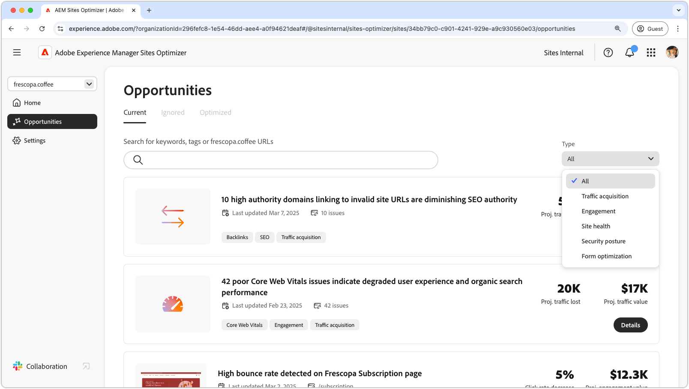
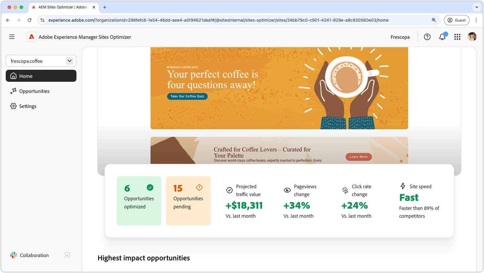

# AEM Sites Optimizer

>[!VIDEO](https://video.tv.adobe.com/v/3455085/?learn=on&enablevpops)

Adobe Experience Manager (AEM) Sites Optimizer is a cloud-based service that analyzes and improves the performance of websites built on AEM. Sites Optimizer identifies areas for improvement in page loading, component usage, and content delivery. This functionality helps enhance your website's performance while reducing maintenance and update costs. By using Sites Optimizer, you can ensure a smooth and reliable online experience, which is important for maintaining engagement and conversions.

## Get started with Sites Optimizer

<!-- CARDS 

* ./opportunity-types/overview.md
   {title=Opportunity types}
   {description = Learn about the available Site Optimizer opportunities and how to use them to improve your site's performance.}
* ./documentation/overview.md
  * {title=Documentation}
  * {description=Explore the Sites Optimizer documentation to learn about all its capabilities.}

-->
<!-- START CARDS HTML - DO NOT MODIFY BY HAND -->

    

        

            

                <figure class="image x-is-16by9">
                    
                </figure>
            

            

                

                    

                        <a href="./opportunity-types/overview.md" target="_blank" rel="referrer" title="Opportunity types">Opportunity types</a>
                    

                    
Learn about the available Site Optimizer opportunities and how to use them to improve your site's performance.

                

                <a href="./opportunity-types/overview.md" target="_blank" rel="referrer" class="spectrum-Button spectrum-Button--outline spectrum-Button--primary spectrum-Button--sizeM" style="align-self: flex-start; margin-top: 1rem;">
                    Learn more
                </a>
            

        

    

    

        

            

                <figure class="image x-is-16by9">
                    
                </figure>
            

            

                

                    

                        <a href="./documentation/overview.md" target="_blank" rel="referrer" title="Documentation">Documentation</a>
                    

                    
Explore the Sites Optimizer documentation to learn about all its capabilities.

                

                <a href="./documentation/overview.md" target="_blank" rel="referrer" class="spectrum-Button spectrum-Button--outline spectrum-Button--primary spectrum-Button--sizeM" style="align-self: flex-start; margin-top: 1rem;">
                    Learn more
                </a>
            

        

    

<!-- END CARDS HTML - DO NOT MODIFY BY HAND -->

## Learn more about Sites Optimizer

<!-- CARDS 
    * https://helpx.adobe.com/legal/product-descriptions/adobe-experience-manager-sites-optimizer.html
        {title=Packages and licensing}
        {description=Learn about AEM Sites Optimizer packages and licensing.}
        {image=https://business.adobe.com/products/experience-manager/sites/media_17296346c44dba1976d5fbac060205b5ec7df0164.png?width=2000&format=webply&optimize=medium}
        {cta=Learn more}
    * https://business.adobe.com/products/experience-manager/sites/optimizer.html
        {title=Explore the capabilities of AEM Sites Optimizer}
        {description=Learn what AEM Site Optimizer can do for your company.}
        {target=_blank}
        {cta=Learn more}
-->
<!-- START CARDS HTML - DO NOT MODIFY BY HAND -->

    

        

            

                <figure class="image x-is-16by9">
                    
                </figure>
            

            

                

                    

                        <a href="https://helpx.adobe.com/legal/product-descriptions/adobe-experience-manager-sites-optimizer.html" target="_blank" rel="referrer" title="Explore the capabilities of AEM Sites Optimizer">Explore the capabilities of AEM Sites Optimizer</a>
                    

                    
Learn what AEM Site Optimizer can do for your company.

                

                <a href="https://helpx.adobe.com/legal/product-descriptions/adobe-experience-manager-sites-optimizer.html" target="_blank" rel="referrer" class="spectrum-Button spectrum-Button--outline spectrum-Button--primary spectrum-Button--sizeM" style="align-self: flex-start; margin-top: 1rem;">
                    Learn more
                </a>
            

        

    

    

        

            

                <figure class="image x-is-16by9">
                    
                </figure>
            

            

                

                    

                        <a href="https://business.adobe.com/products/experience-manager/sites/optimizer.html" target="_blank" rel="referrer" title="Explore the capabilities of AEM Sites Optimizer">Explore the capabilities of AEM Sites Optimizer</a>
                    

                    
Learn what AEM Site Optimizer can do for your company.

                

                <a href="https://business.adobe.com/products/experience-manager/sites/optimizer.html" target="_blank" rel="referrer" class="spectrum-Button spectrum-Button--outline spectrum-Button--primary spectrum-Button--sizeM" style="align-self: flex-start; margin-top: 1rem;">
                    Learn more
                </a>
            

        

    

<!-- END CARDS HTML - DO NOT MODIFY BY HAND -->
