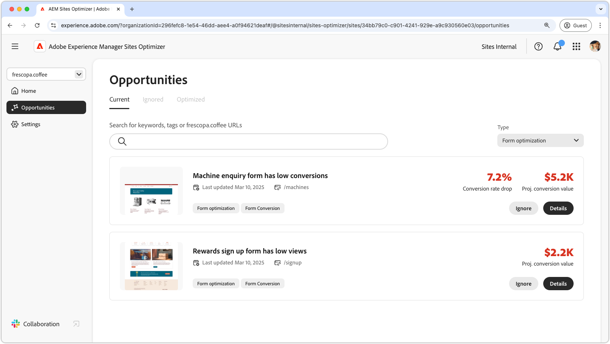
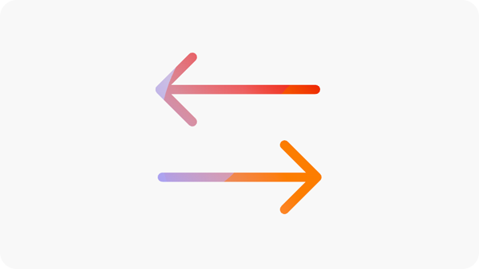

# Forms Accesibility opportunities

 The Forms Optimizer capability is available under early access program. You can write to aem-forms-ea@adobe.com from your official email id to join the early access program and request access to the capability. 

{align="center"}

Forms Accessibility opportunities are critical for enhancing user interactions and increasing conversions. Evaluating your forms for compliance with the Web Content Accessibility Guidelines (WCAG) helps ensure an inclusive experience for users with visual, auditory, cognitive, and motor impairments. This not only fulfills ethical and legal requirements but also improves form completion rates and broadens your audience, resulting in a better user experience and stronger business outcomes.

## Opportunities 

<!-- CARDS
 
* ../documentation/opportunities/low-views.md
  {title=Low views}
  {image=../assets/common/card-bag.png}
* ../documentation/opportunities/low-conversions.md
  {title=Low conversions}
  {image=../assets/common/card-bag.png}

--->
<!-- START CARDS HTML - DO NOT MODIFY BY HAND -->

    

        

            

                <figure class="image x-is-16by9">
                    
                </figure>
            

            

                

                    

                        <a href="../documentation/opportunities/forms-accessibility-issues.md" target="_blank" rel="referrer" title="Forms Accessibility issues">Forms Accessibility issues</a>
                    

                    
Learn about the forms accessibility issues and how to use these to improve forms engagement on your website.

                

                <a href="../documentation/opportunities/forms-accessibility-issues.md" target="_blank" rel="referrer" class="spectrum-Button spectrum-Button--outline spectrum-Button--primary spectrum-Button--sizeM" style="align-self: flex-start; margin-top: 1rem;">
                    Learn more
                </a>
            

        

    

<!-- END CARDS HTML - DO NOT MODIFY BY HAND -->
