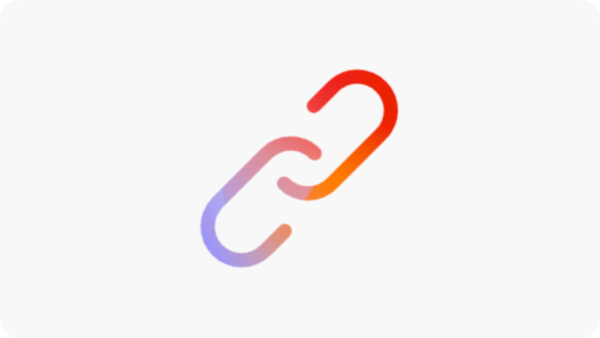

# Preflight opportunities

{align="center"}

<span class="preview">AEM Sites Optimizer Preflight analyzes your page's technical and performance data and anticipates and detects opportunities before it is published. It uses generative AI to suggest optimizations.</span>

## Opportunities

<!-- CARDS

* ../documentation/opportunities/invalid-or-missing-metadata.md
  {title=Canonical}
  {image=../assets/common/card-link.png}
* ../documentation/opportunities/broken-internal-links.md
  {title=Broken Internal Links}
  {image=../assets/common/card-link.png}
* ../documentation/opportunities/invalid-or-missing-metadata.md
  {title=Metatags}
  {image=../assets/common/card-code.png}
* ../documentation/opportunities/invalid-or-missing-metadata.md
  {title=H1 count}
  {image=../assets/common/card-code.png}
* ../documentation/opportunities/accessibility-issues.md
  {title=Accessibility}
  {image=../assets/common/card-puzzle.png}

-->
<!-- START CARDS HTML - DO NOT MODIFY BY HAND -->
<div class="columns">
    <div class="column is-half-tablet is-half-desktop is-one-third-widescreen" aria-label="Canonical">
        <div class="card" style="height: 100%; display: flex; flex-direction: column; height: 100%;">
            <div class="card-image">
                <figure class="image x-is-16by9">
                    <a href="../documentation/opportunities/invalid-or-missing-metadata.md" title="Canonical" target="_blank" rel="referrer">
                        
                    </a>
                </figure>
            </div>
            <div class="card-content is-padded-small" style="display: flex; flex-direction: column; flex-grow: 1; justify-content: space-between;">
                <div class="top-card-content">
                    <p class="headline is-size-6 has-text-weight-bold">
                        <a href="../documentation/opportunities/invalid-or-missing-metadata.md" target="_blank" rel="referrer" title="Canonical">Canonical</a>
                    </p>
                    <p class="is-size-6">Learn about the canonical opportunity and how to use it to improve SEO and prevent duplicate content issues.</p>
                </div>
                <a href="../documentation/opportunities/invalid-or-missing-metadata.md" target="_blank" rel="referrer" class="spectrum-Button spectrum-Button--outline spectrum-Button--primary spectrum-Button--sizeM" style="align-self: flex-start; margin-top: 1rem;">
                    <span class="spectrum-Button-label has-no-wrap has-text-weight-bold">Learn more</span>
                </a>
            </div>
        </div>
    </div>
    <div class="column is-half-tablet is-half-desktop is-one-third-widescreen" aria-label="Broken Internal Links">
        <div class="card" style="height: 100%; display: flex; flex-direction: column; height: 100%;">
            <div class="card-image">
                <figure class="image x-is-16by9">
                    <a href="../documentation/opportunities/broken-internal-links.md" title="Broken Internal Links" target="_blank" rel="referrer">
                        
                    </a>
                </figure>
            </div>
            <div class="card-content is-padded-small" style="display: flex; flex-direction: column; flex-grow: 1; justify-content: space-between;">
                <div class="top-card-content">
                    <p class="headline is-size-6 has-text-weight-bold">
                        <a href="../documentation/opportunities/broken-internal-links.md" target="_blank" rel="referrer" title="Broken Internal Links">Broken Internal Links</a>
                    </p>
                    <p class="is-size-6">Learn about the broken internal links opportunity and how to use it to identify and fix broken or problematic links on your website.</p>
                </div>
                <a href="../documentation/opportunities/broken-internal-links.md" target="_blank" rel="referrer" class="spectrum-Button spectrum-Button--outline spectrum-Button--primary spectrum-Button--sizeM" style="align-self: flex-start; margin-top: 1rem;">
                    <span class="spectrum-Button-label has-no-wrap has-text-weight-bold">Learn more</span>
                </a>
            </div>
        </div>
    </div>
    <div class="column is-half-tablet is-half-desktop is-one-third-widescreen" aria-label="Metatags">
        <div class="card" style="height: 100%; display: flex; flex-direction: column; height: 100%;">
            <div class="card-image">
                <figure class="image x-is-16by9">
                    <a href="../documentation/opportunities/invalid-or-missing-metadata.md" title="Metatags" target="_blank" rel="referrer">
                        
                    </a>
                </figure>
            </div>
            <div class="card-content is-padded-small" style="display: flex; flex-direction: column; flex-grow: 1; justify-content: space-between;">
                <div class="top-card-content">
                    <p class="headline is-size-6 has-text-weight-bold">
                        <a href="../documentation/opportunities/invalid-or-missing-metadata.md" target="_blank" rel="referrer" title="Metatags">Metatags</a>
                    </p>
                    <p class="is-size-6">Learn about the metatags opportunity and how to use it to optimize your page's metadata for better SEO performance.</p>
                </div>
                <a href="../documentation/opportunities/invalid-or-missing-metadata.md" target="_blank" rel="referrer" class="spectrum-Button spectrum-Button--outline spectrum-Button--primary spectrum-Button--sizeM" style="align-self: flex-start; margin-top: 1rem;">
                    <span class="spectrum-Button-label has-no-wrap has-text-weight-bold">Learn more</span>
                </a>
            </div>
        </div>
    </div>
    <div class="column is-half-tablet is-half-desktop is-one-third-widescreen" aria-label="H1 count">
        <div class="card" style="height: 100%; display: flex; flex-direction: column; height: 100%;">
            <div class="card-image">
                <figure class="image x-is-16by9">
                    <a href="../documentation/opportunities/invalid-or-missing-metadata.md" title="H1 count" target="_blank" rel="referrer">
                        
                    </a>
                </figure>
            </div>
            <div class="card-content is-padded-small" style="display: flex; flex-direction: column; flex-grow: 1; justify-content: space-between;">
                <div class="top-card-content">
                    <p class="headline is-size-6 has-text-weight-bold">
                        <a href="../documentation/opportunities/invalid-or-missing-metadata.md" target="_blank" rel="referrer" title="H1 count">H1 count</a>
                    </p>
                    <p class="is-size-6">Learn about the H1 count opportunity and how to use it to ensure proper heading structure and SEO optimization.</p>
                </div>
                <a href="../documentation/opportunities/invalid-or-missing-metadata.md" target="_blank" rel="referrer" class="spectrum-Button spectrum-Button--outline spectrum-Button--primary spectrum-Button--sizeM" style="align-self: flex-start; margin-top: 1rem;">
                    <span class="spectrum-Button-label has-no-wrap has-text-weight-bold">Learn more</span>
                </a>
            </div>
        </div>
    </div>
    <div class="column is-half-tablet is-half-desktop is-one-third-widescreen" aria-label="Accessibility">
        <div class="card" style="height: 100%; display: flex; flex-direction: column; height: 100%;">
            <div class="card-image">
                <figure class="image x-is-16by9">
                    <a href="../documentation/opportunities/accessibility-issues.md" title="Accessibility" target="_blank" rel="referrer">
                        
                    </a>
                </figure>
            </div>
            <div class="card-content is-padded-small" style="display: flex; flex-direction: column; flex-grow: 1; justify-content: space-between;">
                <div class="top-card-content">
                    <p class="headline is-size-6 has-text-weight-bold">
                        <a href="../documentation/opportunities/accessibility-issues.md" target="_blank" rel="referrer" title="Accessibility">Accessibility</a>
                    </p>
                    <p class="is-size-6">Learn about the accessibility opportunity and how to use it to ensure your website is accessible to all users.</p>
                </div>
                <a href="../documentation/opportunities/accessibility-issues.md" target="_blank" rel="referrer" class="spectrum-Button spectrum-Button--outline spectrum-Button--primary spectrum-Button--sizeM" style="align-self: flex-start; margin-top: 1rem;">
                    <span class="spectrum-Button-label has-no-wrap has-text-weight-bold">Learn more</span>
                </a>
            </div>
        </div>
    </div>

</div>
<!-- END CARDS HTML - DO NOT MODIFY BY HAND -->

## How to set up

### Universal Editor Setup

1. Go to the Extension Manager from the URL: https://experience.adobe.com/#/@org/aem/extension-manager/universal-editor
2. Select the AEM Sites Optimizer Preflight Extension and request to Enable
3. The AEM Team will enable the extension for your organization
4. Once that is done, open a page in Universal Editor, such as: https://author-p12345-e123456.adobeaemcloud.com/ui#/@org/aem/universal-editor/canvas/author-p12345-e123456.adobeaemcloud.com/content/site/subscription.html
5. The Preflight extension will be visible in the side rail
6. Clicking on the Preflight Extension from the side rail will start the Preflight Audit for the current page

### Document-Based Preview Setup

#### Step 1: Enable Sidekick with Preflight Button

Add the following configuration to `/tools/sidekick/config.json` in your GitHub repository:

```json
{
  "plugins": [
    {
      "id": "preflight",
      "titleI18n": {
        "en": "Preflight"
      },
      "environments": ["preview"],
      "event": "preflight"
    }
  ]
}
```

#### Step 2: Create the Sidekick Integration Script

Create `/tools/sidekick/aem-sites-optimizer-preflight.js` with the following content:

```javascript
(function () {
  let isAEMSitesOptimizerPreflightAppLoaded = false;
  function loadAEMSitesOptimizerPreflightApp() {
    const script = document.createElement('script');
    script.src = 'https://experience.adobe.com/solutions/OneAdobe-aem-sites-optimizer-preflight-mfe/static-assets/resources/sidekick/client.js?source=plugin';
    script.onload = function () {
      isAEMSitesOptimizerPreflightAppLoaded = true;
    };
    script.onerror = function () {
      console.error('Error loading AEMSitesOptimizerPreflightApp.');
    };
    document.head.appendChild(script);
  }

  function handlePluginButtonClick() {
    if (!isAEMSitesOptimizerPreflightAppLoaded) {
      loadAEMSitesOptimizerPreflightApp();
    }
  }

  // Sidekick V1 extension support
  const sidekick = document.querySelector('helix-sidekick');
  if (sidekick) {
    sidekick.addEventListener('custom:preflight', handlePluginButtonClick);
  } else {
    document.addEventListener('sidekick-ready', () => {
      document.querySelector('helix-sidekick')
        .addEventListener('custom:preflight', handlePluginButtonClick);
    }, { once: true });
  }

  // Sidekick V2 extension support
  const sidekickV2 = document.querySelector('aem-sidekick');
  if (sidekickV2) {
    sidekickV2.addEventListener('custom:preflight', handlePluginButtonClick);
  } else {
    document.addEventListener('sidekick-ready', () => {
      document.querySelector('aem-sidekick')
        .addEventListener('custom:preflight', handlePluginButtonClick);
    }, { once: true });
  }
}());
```

#### Step 3: Update Scripts File

Add the following import statement to the `loadLazy()` function in `/scripts/scripts.js` for preview URLs, as shown below:

```javascript
if (window.location.href.includes('.aem.page')) {
   import('../tools/sidekick/aem-sites-optimizer-preflight.js');
}
```

Now the Preflight button should be visible in Sidekick.

#### Step 4: Running the Audit

Open the preview URL (*.aem.page) of the audited page. Click on the Preflight button from Sidekick.  

### AEM Cloud Service Setup

You can use the bookmarklet option to test Preflight on AEM Cloud Service Page Editors and Sandbox Environments.

<!-- Drag the button below to your Bookmarks Bar to get started. -->

Press **Ctrl+Shift+B** (Windows) or **Cmd+Shift+B** (Mac) to show your Bookmarks Bar. Right-click the bookmarks bar and select "New Page" or "Add Bookmark". In the adress field copy the code below.

<!-- **Drag this link to your Bookmarks Bar:**

<a href="javascript:(function(){const script=document.createElement('script');script.src='https://experience.adobe.com/solutions/OneAdobe-aem-sites-optimizer-preflight-mfe/static-assets/resources/sidekick/client.js?source=bookmarklet&target-source=aem-cloud-service';document.head.appendChild(script);})();">Preflight</a> -->

**Copy this code and create a new bookmark:**

```

javascript:(function(){const script=document.createElement('script');script.src='https://experience.adobe.com/solutions/OneAdobe-aem-sites-optimizer-preflight-mfe/static-assets/resources/sidekick/client.js?source=bookmarklet&target-source=aem-cloud-service';document.head.appendChild(script);})();
```

Once the Bookmarklet is added, open the preview URL (*.aem.page) of the audited page. Click on the Preflight bookmark to start the Preflight Audit.

## Best Practices

When using Preflight please be aware of the following:

* Run Preflight audits on all staging/preview pages before publishing.
* Address high-impact issues first (broken links, missing H1 tags, insecure links).
* Enable authentication for protected staging environments.
* Review and implement meta tag suggestions for better SEO performance.
